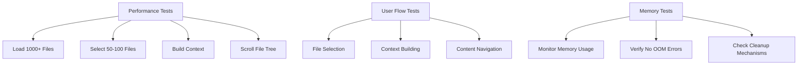
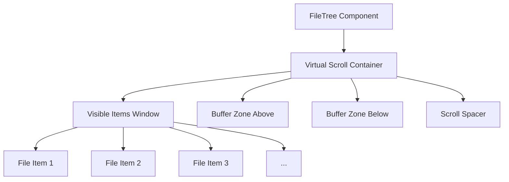
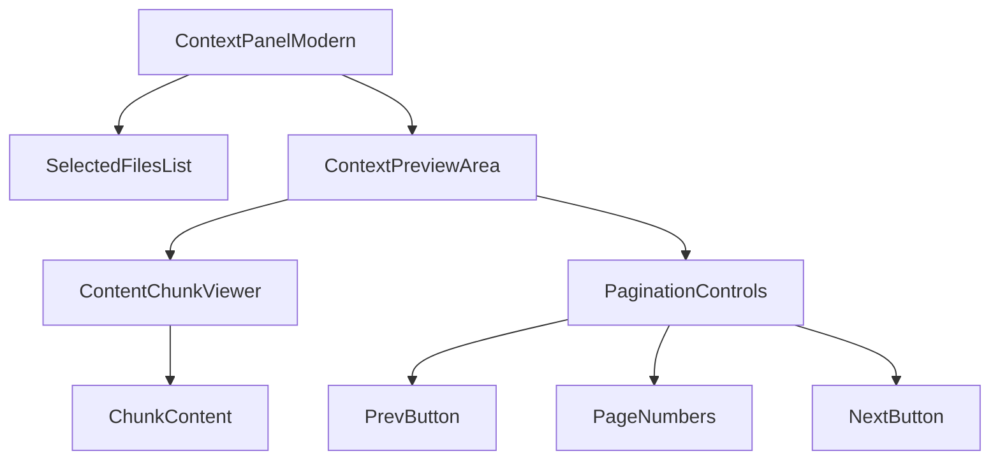
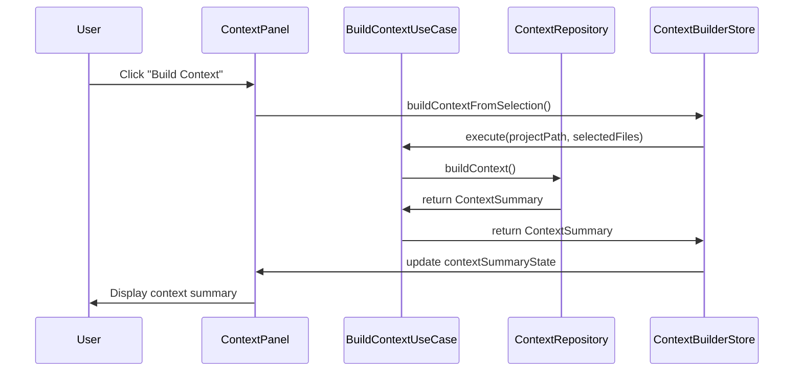
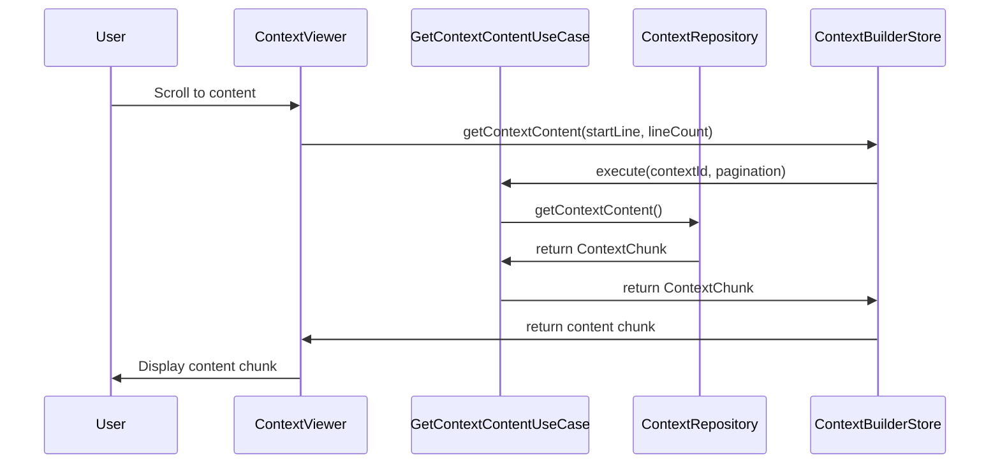

# Shotgun Code Frontend Refactoring Design Document

## 1. Overview

This document outlines the comprehensive refactoring plan for the Shotgun Code frontend application to address critical performance, memory, and UX issues. The refactoring focuses on implementing Clean Architecture principles, resolving memory leaks, and improving user experience through virtualization and better state management.

### 1.1 Current Issues

1. **Critical Memory Leak (OOM)**: The `context-builder.store` loads entire file contents into reactive Pinia state (`shotgunContextText`), causing browser tab crashes with even moderate file selections.
2. **Unresponsive UI**: File tree lacks virtualization, causing UI freezes on projects with large numbers of files.
3. **State Synchronization Issues**: File selection and display logic is scattered across three different stores (`file-tree.store`, `tree-state.store`, `context-builder.store`), leading to inconsistencies.
4. **Poor UX**: Missing loading states, error feedback, and user guidance creates a perception of a broken application.

### 1.2 Refactoring Goals

1. **Memory Safety**: Eliminate memory leaks by avoiding storage of large data in reactive state
2. **Performance**: Implement virtualization for smooth UI interactions with large datasets
3. **Architecture**: Apply Clean Architecture principles with clear separation of concerns
4. **User Experience**: Provide responsive UI with proper feedback mechanisms

## 2. Architecture

### 2.1 Current Architecture Issues

The current frontend architecture suffers from several critical issues:

1. **State Fragmentation**: File selection state is distributed across multiple stores:
   - `file-tree.store.ts`: Manages file tree data and metadata
   - `tree-state.store.ts`: Manages UI state (expanded/selected paths)
   - `context-builder.store.ts`: Manages context building and selection synchronization

2. **Memory Inefficiency**: Storing full file contents in reactive state causes memory bloat

3. **Poor Separation of Concerns**: Business logic is mixed with UI concerns in components

### 2.2 Proposed Architecture

The refactored architecture will follow Clean Architecture principles with clear layer separation:

```
┌─────────────────────────────────────────────────────────────┐
│                    Presentation Layer                       │
│  ┌─────────────┐  ┌─────────────┐  ┌────────────────────┐  │
│  │   Views     │  │ Components  │  │    Composables     │  │
│  └─────────────┘  └─────────────┘  └────────────────────┘  │
├─────────────────────────────────────────────────────────────┤
│                    Application Layer                        │
│  ┌────────────────────────────────────────────────────────┐ │
│  │                   Use Cases                            │ │
│  │  ┌─────────────────┐  ┌─────────────────────────────┐  │ │
│  │  │ BuildContext    │  │ GetContextContent           │  │ │
│  │  └─────────────────┘  └─────────────────────────────┘  │ │
│  └────────────────────────────────────────────────────────┘ │
├─────────────────────────────────────────────────────────────┤
│                     Domain Layer                            │
│  ┌────────────────────────────────────────────────────────┐ │
│  │                    Services                            │ │
│  │  ┌─────────────────┐  ┌─────────────────────────────┐  │ │
│  │  │ VirtualScroll   │  │ FileTreeAnalysis            │  │ │
│  │  └─────────────────┘  └─────────────────────────────┘  │ │
│  │                                                         │ │
│  │  ┌─────────────────┐  ┌─────────────────────────────┐  │ │
│  │  │ Repositories    │  │ Entities                    │  │ │
│  │  └─────────────────┘  └─────────────────────────────┘  │ │
│  └────────────────────────────────────────────────────────┘ │
├─────────────────────────────────────────────────────────────┤
│                 Infrastructure Layer                        │
│  ┌────────────────────────────────────────────────────────┐ │
│  │                    Adapters                            │ │
│  │  ┌─────────────────┐  ┌─────────────────────────────┐  │ │
│  │  │ ContextAPI      │  │ ProjectAPI                  │  │ │
│  │  └─────────────────┘  └─────────────────────────────┘  │ │
│  └────────────────────────────────────────────────────────┘ │
└─────────────────────────────────────────────────────────────┘
```

### 2.3 State Management Redesign

#### 2.3.1 Centralized File Tree State

Consolidate file tree UI state into a single store:

**Before**:
- `file-tree.store.ts`: File metadata and basic selection
- `tree-state.store.ts`: Expanded/selected paths
- `context-builder.store.ts`: Context-related selection state

**After**:
- `file-tree.store.ts`: Single source of truth for all file tree state including:
  - File metadata (nodes, maps)
  - UI state (expanded paths, selected paths)
  - Loading/error states

#### 2.3.2 Memory-Safe Context Management

Replace full content storage with pagination-based approach:

**Before**:
- Store full context content in reactive state
- Load entire context into memory for display

**After**:
- Store only context metadata (ID, file count, size, tokens)
- Implement pagination for content retrieval
- Load only visible content chunks on demand

## 3. Component Architecture

### 3.1 File Tree Virtualization

#### 3.1.1 Current Implementation Issues

1. No virtualization - all nodes rendered regardless of visibility
2. Recursive component structure causes performance issues
3. No memory management for large trees

#### 3.1.2 Proposed Solution

Implement virtual scrolling for the file tree:

```
┌─────────────────────────────────────────────────────────────┐
│                    FileTree Component                       │
│                                                             │
│  ┌────────────────────────────────────────────────────────┐ │
│  │                   Virtual Scroll                       │ │
│  │  ┌────────────────────────────────────────────────────┐│ │
│  │  │              Visible Items (20-50)                 ││ │
│  │  │  ┌─────────┐  ┌─────────┐  ┌─────────┐            ││ │
│  │  │  │ File 20 │  │ File 21 │  │ File 22 │  ...       ││ │
│  │  │  └─────────┘  └─────────┘  └─────────┘            ││ │
│  │  └────────────────────────────────────────────────────┘│ │
│  │                                                         │ │
│  │  Total Height: 10,000px                                 │ │
│  │  Visible Height: 400px                                  │ │
│  │  Offset: 800px                                          │ │
│  └────────────────────────────────────────────────────────┘ │
└─────────────────────────────────────────────────────────────┘
```

### 3.2 Context Panel Redesign

#### 3.2.1 Current Issues

1. Textarea-based file selection is unintuitive
2. Full context content stored in memory
3. No pagination for large contexts

#### 3.2.2 Proposed Solution

1. Replace textarea with file list display
2. Implement chunked content loading
3. Add file-specific actions (preview, remove)

```
┌─────────────────────────────────────────────────────────────┐
│                   Context Panel Modern                      │
│                                                             │
│  ┌────────────────────────────────────────────────────────┐ │
│  │                 Selected Files List                    │ │
│  │  ┌────────────────────────────────────────────────────┐│ │
│  │  │ file1.ts                    [Preview] [Remove]     ││ │
│  │  │ file2.vue                   [Preview] [Remove]     ││ │
│  │  │ file3.py                    [Preview] [Remove]     ││ │
│  │  └────────────────────────────────────────────────────┘│ │
│  └────────────────────────────────────────────────────────┘ │
│                                                             │
│  ┌────────────────────────────────────────────────────────┐ │
│  │                 Context Preview                        │ │
│  │  ┌────────────────────────────────────────────────────┐│ │
│  │  │                                                    ││ │
│  │  │  Chunk 1 of 10 (Lines 1-100)                       ││ │
│  │  │  [Content...]                                      ││ │
│  │  │                                                    ││ │
│  │  │  ┌────────────────────────────────────────────────┐││ │
│  │  │  │  [Prev] [1] [2] [3] ... [10] [Next]            │││ │
│  │  │  └────────────────────────────────────────────────┘││ │
│  │  └────────────────────────────────────────────────────┘│ │
│  └────────────────────────────────────────────────────────┘ │
└─────────────────────────────────────────────────────────────┘
```

## 4. State Management

### 4.1 File Tree State Consolidation

#### 4.1.1 Current State Distribution

```
file-tree.store.ts:
- nodes: FileNode[]
- nodesMap: Map<string, FileNode>
- isLoading: boolean
- error: string | null

tree-state.store.ts:
- expandedPaths: Set<string>
- selectedPaths: Set<string>
- activeNodePath: string | null

context-builder.store.ts:
- selectedFilesList: string[]
```

#### 4.1.2 Proposed Consolidated State

```
file-tree.store.ts:
- nodes: FileNode[]
- nodesMap: Map<string, FileNode>
- isLoading: boolean
- error: string | null
- expandedPaths: Set<string>
- selectedPaths: Set<string>
- activeNodePath: string | null
```

#### 4.1.3 Implementation Plan

1. **Migration Strategy**:
   - Move `expandedPaths` and `selectedPaths` from `tree-state.store.ts` to `file-tree.store.ts`
   - Update all components to use the consolidated store
   - Deprecate `tree-state.store.ts` after migration

2. **Reactivity Optimization**:
   - Use `readonly` refs to prevent accidental mutations
   - Implement selective reactivity with computed properties
   - Add performance monitoring for state updates

### 4.2 Context State Optimization

#### 4.2.1 Current Memory Issues

The `context-builder.store.ts` currently stores full context content:

```typescript
// Problematic approach
const shotgunContextText = ref<string>(''); // Full context content in reactive state
```

This causes OOM errors when building contexts with large files.

#### 4.2.2 Proposed Memory-Safe Approach

Replace with pagination-based content access:

```typescript
// Memory-safe approach
const contextSummaryState = ref<ContextSummary | null>(null); // Only metadata
const currentContextId = ref<string | null>(null); // Context identifier
const currentContextChunkIndex = ref<number>(0); // Current chunk index

// Load content on demand
const getContextContent = async (startLine: number, lineCount: number): Promise<ContextChunk | null> => {
  // Implementation that fetches only requested content
}
```

#### 4.2.3 Data Flow Diagram

```
graph LR
    A[User Selection] --> B[BuildContextUseCase]
    B --> C[ContextRepository]
    C --> D[Backend Service]
    D --> E[ContextSummary]
    E --> F[ContextBuilderStore]
    F --> G[ContextPanel]
    G --> H[Paginated Content Request]
    H --> I[GetContextContentUseCase]
    I --> J[ContextRepository]
    J --> K[Backend Service]
    K --> L[ContextChunk]
    L --> G
```

## 5. Business Logic Layer

### 5.1 Use Case Implementation

#### 5.1.1 BuildContextUseCase

**Purpose**: Create memory-safe context summaries instead of full content

**Current Implementation Issues**:
- Returns full context content causing memory issues
- No streaming support for large contexts

**Refactored Implementation**:
```
export class BuildContextUseCase {
  async execute(
    projectPath: string,
    selectedFiles: string[],
    options?: ContextBuildOptions
  ): Promise<ContextSummary> {
    // Validate inputs
    // Assess memory impact
    // Decide on streaming vs regular build
    // Return only metadata, not full content
  }
}
```

#### 5.1.2 GetContextContentUseCase

**Purpose**: Retrieve paginated context content without loading full content into memory

**Implementation**:
```
export class GetContextContentUseCase {
  async execute(
    contextId: string,
    pagination: PaginationOptions
  ): Promise<ContextChunk> {
    // Validate inputs
    // Limit chunk size to prevent memory issues
    // Retrieve only requested content range
    // Return chunked content
  }
}
```

### 5.2 Domain Services

#### 5.2.1 VirtualScrollingService

**Purpose**: Handle virtual scrolling calculations and optimizations

**Key Functions**:
- Calculate visible item range based on scroll position
- Determine optimal buffer sizes
- Provide performance recommendations

#### 5.2.2 FileTreeAnalysisService

**Purpose**: Analyze file tree structure and provide insights

**Key Functions**:
- Count total files in tree
- Collect files with limits
- Analyze selection patterns

### 5.3 Use Case Orchestration

#### 5.3.1 Context Building Flow

```
sequenceDiagram
    participant U as User
    participant C as ContextPanel
    participant B as BuildContextUseCase
    participant R as ContextRepository
    participant S as ContextBuilderStore
    
    U->>C: Click "Build Context"
    C->>S: buildContextFromSelection()
    S->>B: execute(projectPath, selectedFiles)
    B->>R: buildContext()
    R->>B: return ContextSummary
    B->>S: return ContextSummary
    S->>C: update contextSummaryState
    C->>U: Display context summary
```

#### 5.3.2 Content Retrieval Flow

```
sequenceDiagram
    participant U as User
    participant C as ContextViewer
    participant G as GetContextContentUseCase
    participant R as ContextRepository
    participant S as ContextBuilderStore
    
    U->>C: Scroll to content
    C->>S: getContextContent(startLine, lineCount)
    S->>G: execute(contextId, pagination)
    G->>R: getContextContent()
    R->>G: return ContextChunk
    G->>S: return ContextChunk
    S->>C: return content chunk
    C->>U: Display content chunk
```

## 6. API Integration Layer

### 6.1 Context Repository Interface

The refactored system will use a repository pattern for context operations:

```
interface ContextRepository {
  buildContext(
    projectPath: string, 
    includedPaths: string[], 
    options?: ContextBuildOptions
  ): Promise<ContextSummary>;
  
  getContextSummary(id: string): Promise<ContextSummary>;
  
  getContextContent(
    id: string, 
    pagination: PaginationOptions
  ): Promise<ContextChunk>;
  
  deleteContext(id: string): Promise<void>;
}
```

### 6.2 Memory-Safe API Adapter

The `ContextApiAdapter` implements memory-safe operations:

```
export class ContextApiAdapter implements ContextRepository {
  async buildContext(
    projectPath: string, 
    includedPaths: string[], 
    options?: ContextBuildOptions
  ): Promise<ContextSummary> {
    // Return only metadata, not full content
  }
  
  async getContextContent(
    id: string, 
    pagination: PaginationOptions
  ): Promise<ContextChunk> {
    // Fetch only requested content range
  }
}
```

### 6.3 Error Handling and Recovery

#### 6.3.1 Backend Error Patterns

Implement robust error handling for common backend issues:

```
private handleError(error: unknown, context: string): Error {
  const message = error instanceof Error ? error.message : String(error);
  
  // Check if this is a domain error from backend
  if (message.startsWith('domain_error:')) {
    try {
      const domainErrorJson = message.substring('domain_error:'.length);
      const domainError = JSON.parse(domainErrorJson);
      
      const structuredError = new Error(`${context}: ${domainError.message}`);
      (structuredError as any).code = domainError.code;
      (structuredError as any).recoverable = domainError.recoverable;
      return structuredError;
    } catch (parseErr) {
      console.error('Failed to parse domain error:', parseErr);
    }
  }
  
  return new Error(`${context}: ${message}`);
}
```

#### 6.3.2 Recovery Strategies

1. **Memory Error Recovery**:
   - Detect "nil map" assignment errors
   - Attempt minimal context building as fallback
   - Provide user-friendly error messages

2. **Timeout Handling**:
   - Implement 30-second timeout for context building
   - Cancel operations that exceed time limits
   - Provide clear timeout feedback to users

## 7. Performance Optimizations

### 7.1 Virtual Scrolling Implementation

#### 7.1.1 Technical Approach

Implement virtual scrolling using the `useVirtualScroll` composable:

```
export function useVirtualScroll(options: VirtualScrollOptions) {
  const { itemHeight, containerHeight, buffer, totalItems } = options;
  
  const scrollTop = ref(0);
  const containerRef = ref<HTMLElement | null>(null);
  
  // Calculate visible range
  const visibleRange = computed(() => {
    const start = Math.floor(scrollTop.value / itemHeight);
    const visibleCount = Math.ceil(containerHeight / itemHeight);
    const bufferCount = buffer || 5;
    
    return {
      start: Math.max(0, start - bufferCount),
      end: Math.min(totalItems - 1, start + visibleCount + bufferCount)
    };
  });
  
  // Handle scroll events
  const handleScroll = (event: Event) => {
    const target = event.target as HTMLElement;
    scrollTop.value = target.scrollTop;
  };
}
```

#### 7.1.2 Performance Benefits

1. **Reduced DOM Nodes**: Only render visible items (~20-50 nodes vs. thousands)
2. **Memory Efficiency**: Minimal memory footprint regardless of total item count
3. **Smooth Scrolling**: Consistent 60fps performance even with large datasets

### 7.2 Memory Management

#### 7.2.1 Automatic Cleanup

Implement automatic cleanup mechanisms:

```
// In tree-state.store.ts
function performAutomaticCleanup() {
  // Clean up selected paths if too many
  if (selectedPaths.value.size > MAX_SELECTED_PATHS) {
    const pathArray = Array.from(selectedPaths.value);
    const toKeep = pathArray.slice(-MAX_SELECTED_PATHS);
    selectedPaths.value = new Set(toKeep);
  }
  
  // Clean up expanded paths if too many
  if (expandedPaths.value.size > MAX_EXPANDED_PATHS) {
    const pathArray = Array.from(expandedPaths.value);
    const toKeep = pathArray.slice(-MAX_EXPANDED_PATHS);
    expandedPaths.value = new Set(toKeep);
  }
}
```

#### 7.2.2 Configuration-Based Limits

Use centralized configuration for performance limits:

```
// app-config.ts
performance: {
  memory: {
    MAX_FILE_LIMIT: 10,
    MAX_INDIVIDUAL_FILE_SIZE: 32 * 1024, // 32KB
    WARNING_THRESHOLD_MB: 20,
    CRITICAL_THRESHOLD_MB: 30
  },
  limits: {
    MAX_SELECTED_PATHS: 500,
    MAX_EXPANDED_PATHS: 200
  }
}
```

### 7.3 Debouncing and Throttling

#### 7.3.1 Event Handling Optimization

Implement debouncing for rapid UI interactions:

```
// In FileTreeItem.vue
const isProcessing = ref(false);
const lastClickTime = ref(0);
const CLICK_DEBOUNCE_MS = 300; // Minimum 300ms between clicks

function handleRowClick(event: MouseEvent) {
  // CRITICAL: Debounce rapid clicks to prevent memory issues
  const now = Date.now();
  if (isProcessing.value || (now - lastClickTime.value) < CLICK_DEBOUNCE_MS) {
    console.log('Ignoring rapid click on row');
    return;
  }
  
  isProcessing.value = true;
  lastClickTime.value = now;
  
  try {
    // Handle click logic
  } finally {
    // Release processing lock after delay
    setTimeout(() => {
      isProcessing.value = false;
    }, CLICK_DEBOUNCE_MS);
  }
}
```

#### 7.3.2 Memory Monitoring

Implement memory usage monitoring:

```
// In context-builder.store.ts
const getMemoryStats = () => {
  if ('performance' in window && 'memory' in (performance as any)) {
    const memory: { usedJSHeapSize: number; jsHeapSizeLimit: number } = (performance as any).memory;
    return {
      used: Math.round(memory.usedJSHeapSize / (1024 * 1024)),
      total: Math.round(memory.jsHeapSizeLimit / (1024 * 1024)),
      percentage: Math.round((memory.usedJSHeapSize / memory.jsHeapSizeLimit) * 100)
    };
  }
  return null;
};
```

## 8. User Experience Improvements

### 8.1 Loading States

Implement comprehensive loading states:

1. **Skeleton Loaders**: Display during initial file tree loading
2. **Progress Indicators**: Show during context building
3. **Content Placeholders**: Display while fetching context chunks

### 8.2 Error Handling

Enhance error handling with user-friendly messages:

1. **Context Size Warnings**: Alert when selecting too many/large files
2. **Memory Warnings**: Notify when approaching memory limits
3. **Recovery Options**: Provide "Try Again" buttons for failed operations

### 8.3 Selection Feedback

Improve selection feedback mechanisms:

1. **Tri-State Checkboxes**: Visual indication of partial folder selection
2. **Selection Counters**: Display number of selected files/tokens
3. **Warning Modals**: Confirm when selecting large numbers of files

## 9. Testing Strategy

### 9.1 Unit Testing

#### 9.1.1 Store Tests

Test consolidated file tree store functionality:
- State management (selection, expansion)
- Memory cleanup mechanisms
- Performance limits enforcement

#### 9.1.2 Use Case Tests

Test business logic implementations:
- Context building with various file sizes
- Pagination content retrieval
- Error handling scenarios

Test example:
```
// context-builder.store.test.ts
it('should build context without storing full content', async () => {
  const store = useContextBuilderStore();
  
  await store.buildContextFromSelection('/test/project', ['file1.ts', 'file2.ts']);
  
  // Verify only metadata is stored
  expect(store.contextSummaryState).toBeDefined();
  expect(store.contextSummaryState?.id).toBeDefined();
  expect(store.contextSummaryState?.fileCount).toBe(2);
  
  // Verify full content is not stored
  expect(store.shotgunContextText).toBeUndefined();
});
```

### 9.2 Integration Testing

#### 9.2.1 Component Integration

Test component interactions:
- File tree virtualization performance
- Context panel content loading
- State synchronization between components

#### 9.2.2 API Integration

Test repository pattern implementation:
- Context building through adapter
- Pagination content retrieval
- Error handling and recovery

### 9.3 End-to-End Testing

#### 9.3.1 Performance Scenarios

Test with large projects:
- Load project with >1000 files
- Select 50-100 files of various sizes
- Build context and verify no OOM errors
- Scroll through file tree smoothly

#### 9.3.2 User Interaction Scenarios

Test user workflows:
- File selection with tri-state checkboxes
- Context building with large file sets
- Content navigation through pagination

#### 9.3.3 Test Automation Plan

```
graph TD
    A[Performance Tests] --> B[Load 1000+ Files]
    A --> C[Select 50-100 Files]
    A --> D[Build Context]
    A --> E[Scroll File Tree]
    
    F[User Flow Tests] --> G[File Selection]
    F --> H[Context Building]
    F --> I[Content Navigation]
    
    J[Memory Tests] --> K[Monitor Memory Usage]
    J --> L[Verify No OOM Errors]
    J --> M[Check Cleanup Mechanisms]
```

## 10. Implementation Plan

### 10.1 Phase 1: State Management Refactoring (Week 1)

1. Consolidate file tree state into single store
2. Remove redundant state synchronization logic
3. Implement automatic cleanup mechanisms
4. Add performance monitoring

### 10.2 Phase 2: Memory Optimization (Week 2)

1. Replace full context storage with pagination
2. Implement GetContextContentUseCase
3. Update ContextApiAdapter for chunked retrieval
4. Modify context panel to use paginated content

### 10.3 Phase 3: Virtualization Implementation (Week 3)

1. Implement virtual scrolling for file tree
2. Update FileTree components to use virtualization
3. Optimize rendering performance
4. Test with large file sets

### 10.4 Phase 4: UI/UX Improvements (Week 4)

1. Redesign context panel with file list
2. Implement loading states and error handling
3. Add user feedback mechanisms
4. Conduct usability testing

### 10.5 Phase 5: Testing and Optimization (Week 5)

1. Implement comprehensive test suite
2. Conduct performance testing
3. Optimize based on test results
4. Document final implementation
- Context building through adapter
- Pagination content retrieval
- Error handling and recovery

### 9.3 End-to-End Testing

#### 9.3.1 Performance Scenarios

Test with large projects:
- Load project with >1000 files
- Select 50-100 files of various sizes
- Build context and verify no OOM errors
- Scroll through file tree smoothly

#### 9.3.2 User Interaction Scenarios

Test user workflows:
- File selection with tri-state checkboxes
- Context building with large file sets
- Content navigation through pagination

#### 9.3.3 Test Automation Plan



## 10. Implementation Plan

### 10.1 Phase 1: State Management Refactoring (Week 1)

1. Consolidate file tree state into single store
2. Remove redundant state synchronization logic
3. Implement automatic cleanup mechanisms
4. Add performance monitoring

### 10.2 Phase 2: Memory Optimization (Week 2)

1. Replace full context storage with pagination
2. Implement GetContextContentUseCase
3. Update ContextApiAdapter for chunked retrieval
4. Modify context panel to use paginated content

### 10.3 Phase 3: Virtualization Implementation (Week 3)

1. Implement virtual scrolling for file tree
2. Update FileTree components to use virtualization
3. Optimize rendering performance
4. Test with large file sets

### 10.4 Phase 4: UI/UX Improvements (Week 4)

1. Redesign context panel with file list
2. Implement loading states and error handling
3. Add user feedback mechanisms
4. Conduct usability testing

### 10.5 Phase 5: Testing and Optimization (Week 5)

1. Implement comprehensive test suite
2. Conduct performance testing
3. Optimize based on test results
4. Document final implementation```
```

```
# Shotgun Code Frontend Refactoring Design Document

## 1. Overview

This document outlines the comprehensive refactoring plan for the Shotgun Code frontend application to address critical performance, memory, and UX issues. The refactoring focuses on implementing Clean Architecture principles, resolving memory leaks, and improving user experience through virtualization and better state management.

### 1.1 Current Issues

1. **Critical Memory Leak (OOM)**: The `context-builder.store` loads entire file contents into reactive Pinia state (`shotgunContextText`), causing browser tab crashes with even moderate file selections.
2. **Unresponsive UI**: File tree lacks virtualization, causing UI freezes on projects with large numbers of files.
3. **State Synchronization Issues**: File selection and display logic is scattered across three different stores (`file-tree.store`, `tree-state.store`, `context-builder.store`), leading to inconsistencies.
4. **Poor UX**: Missing loading states, error feedback, and user guidance creates a perception of a broken application.

### 1.2 Refactoring Goals

1. **Memory Safety**: Eliminate memory leaks by avoiding storage of large data in reactive state
2. **Performance**: Implement virtualization for smooth UI interactions with large datasets
3. **Architecture**: Apply Clean Architecture principles with clear separation of concerns
4. **User Experience**: Provide responsive UI with proper feedback mechanisms

## 2. Architecture

### 2.1 Current Architecture Issues

The current frontend architecture suffers from several critical issues:

1. **State Fragmentation**: File selection state is distributed across multiple stores:
   - `file-tree.store.ts`: Manages file tree data and metadata
   - `tree-state.store.ts`: Manages UI state (expanded/selected paths)
   - `context-builder.store.ts`: Manages context building and selection synchronization

2. **Memory Inefficiency**: Storing full file contents in reactive state causes memory bloat

3. **Poor Separation of Concerns**: Business logic is mixed with UI concerns in components

### 2.2 Proposed Architecture

The refactored architecture will follow Clean Architecture principles with clear layer separation:

```
┌─────────────────────────────────────────────────────────────┐
│                    Presentation Layer                       │
│  ┌─────────────┐  ┌─────────────┐  ┌────────────────────┐  │
│  │   Views     │  │ Components  │  │    Composables     │  │
│  └─────────────┘  └─────────────┘  └────────────────────┘  │
├─────────────────────────────────────────────────────────────┤
│                    Application Layer                        │
│  ┌────────────────────────────────────────────────────────┐ │
│  │                   Use Cases                            │ │
│  │  ┌─────────────────┐  ┌─────────────────────────────┐  │ │
│  │  │ BuildContext    │  │ GetContextContent           │  │ │
│  │  └─────────────────┘  └─────────────────────────────┘  │ │
│  └────────────────────────────────────────────────────────┘ │
├─────────────────────────────────────────────────────────────┤
│                     Domain Layer                            │
│  ┌────────────────────────────────────────────────────────┐ │
│  │                    Services                            │ │
│  │  ┌─────────────────┐  ┌─────────────────────────────┐  │ │
│  │  │ VirtualScroll   │  │ FileTreeAnalysis            │  │ │
│  │  └─────────────────┘  └─────────────────────────────┘  │ │
│  │                                                         │ │
│  │  ┌─────────────────┐  ┌─────────────────────────────┐  │ │
│  │  │ Repositories    │  │ Entities                    │  │ │
│  │  └─────────────────┘  └─────────────────────────────┘  │ │
│  └────────────────────────────────────────────────────────┘ │
├─────────────────────────────────────────────────────────────┤
│                 Infrastructure Layer                        │
│  ┌────────────────────────────────────────────────────────┐ │
│  │                    Adapters                            │ │
│  │  ┌─────────────────┐  ┌─────────────────────────────┐  │ │
│  │  │ ContextAPI      │  │ ProjectAPI                  │  │ │
│  │  └─────────────────┘  └─────────────────────────────┘  │ │
│  └────────────────────────────────────────────────────────┘ │
└─────────────────────────────────────────────────────────────┘
```

### 2.3 State Management Redesign

#### 2.3.1 Centralized File Tree State

Consolidate file tree UI state into a single store:

**Before**:
- `file-tree.store.ts`: File metadata and basic selection
- `tree-state.store.ts`: Expanded/selected paths
- `context-builder.store.ts`: Context-related selection state

**After**:
- `file-tree.store.ts`: Single source of truth for all file tree state including:
  - File metadata (nodes, maps)
  - UI state (expanded paths, selected paths)
  - Loading/error states

#### 2.3.2 Memory-Safe Context Management

Replace full content storage with pagination-based approach:

**Before**:
- Store full context content in reactive state
- Load entire context into memory for display

**After**:
- Store only context metadata (ID, file count, size, tokens)
- Implement pagination for content retrieval
- Load only visible content chunks on demand

## 3. Component Architecture

### 3.1 File Tree Virtualization

#### 3.1.1 Current Implementation Issues

1. No virtualization - all nodes rendered regardless of visibility
2. Recursive component structure causes performance issues
3. No memory management for large trees

#### 3.1.2 Proposed Solution

Implement virtual scrolling for the file tree:



#### 3.1.3 Implementation Details

1. **Virtual Scroll Composable**:
   - Calculate visible range based on scroll position
   - Maintain buffer zones above/below visible area
   - Optimize re-rendering with memoization

2. **FileTreeItem Component**:
   - Simplified rendering without recursion
   - Efficient event handling
   - Proper cleanup of event listeners

3. **Performance Optimizations**:
   - Passive event listeners for scrolling
   - RequestAnimationFrame for scroll updates
   - Dynamic buffer sizing based on performance

### 3.2 Context Panel Redesign

#### 3.2.1 Current Issues

1. Textarea-based file selection is unintuitive
2. Full context content stored in memory
3. No pagination for large contexts

#### 3.2.2 Proposed Solution

1. Replace textarea with file list display
2. Implement chunked content loading
3. Add file-specific actions (preview, remove)



### 3.1 File Tree Virtualization

#### 3.1.1 Current Implementation Issues

1. No virtualization - all nodes rendered regardless of visibility
2. Recursive component structure causes performance issues
3. No memory management for large trees

#### 3.1.2 Proposed Solution

Implement virtual scrolling for the file tree:

```
┌─────────────────────────────────────────────────────────────┐
│                    FileTree Component                       │
│                                                             │
│  ┌────────────────────────────────────────────────────────┐ │
│  │                   Virtual Scroll                       │ │
│  │  ┌────────────────────────────────────────────────────┐│ │
│  │  │              Visible Items (20-50)                 ││ │
│  │  │  ┌─────────┐  ┌─────────┐  ┌─────────┐            ││ │
│  │  │  │ File 20 │  │ File 21 │  │ File 22 │  ...       ││ │
│  │  │  └─────────┘  └─────────┘  └─────────┘            ││ │
│  │  └────────────────────────────────────────────────────┘│ │
│  │                                                         │ │
│  │  Total Height: 10,000px                                 │ │
│  │  Visible Height: 400px                                  │ │
│  │  Offset: 800px                                          │ │
│  └────────────────────────────────────────────────────────┘ │
└─────────────────────────────────────────────────────────────┘
```

### 3.2 Context Panel Redesign

#### 3.2.1 Current Issues

1. Textarea-based file selection is unintuitive
2. Full context content stored in memory
3. No pagination for large contexts

#### 3.2.2 Proposed Solution

1. Replace textarea with file list display
2. Implement chunked content loading
3. Add file-specific actions (preview, remove)

```
┌─────────────────────────────────────────────────────────────┐
│                   Context Panel Modern                      │
│                                                             │
│  ┌────────────────────────────────────────────────────────┐ │
│  │                 Selected Files List                    │ │
│  │  ┌────────────────────────────────────────────────────┐│ │
│  │  │ file1.ts                    [Preview] [Remove]     ││ │
│  │  │ file2.vue                   [Preview] [Remove]     ││ │
│  │  │ file3.py                    [Preview] [Remove]     ││ │
│  │  └────────────────────────────────────────────────────┘│ │
│  └────────────────────────────────────────────────────────┘ │
│                                                             │
│  ┌────────────────────────────────────────────────────────┐ │
│  │                 Context Preview                        │ │
│  │  ┌────────────────────────────────────────────────────┐│ │
│  │  │                                                    ││ │
│  │  │  Chunk 1 of 10 (Lines 1-100)                       ││ │
│  │  │  [Content...]                                      ││ │
│  │  │                                                    ││ │
│  │  │  ┌────────────────────────────────────────────────┐││ │
│  │  │  │  [Prev] [1] [2] [3] ... [10] [Next]            │││ │
│  │  │  └────────────────────────────────────────────────┘││ │
│  │  └────────────────────────────────────────────────────┘│ │
│  └────────────────────────────────────────────────────────┘ │
└─────────────────────────────────────────────────────────────┘
```

## 4. State Management

### 4.1 File Tree State Consolidation

#### 4.1.1 Current State Distribution

```
file-tree.store.ts:
- nodes: FileNode[]
- nodesMap: Map<string, FileNode>
- isLoading: boolean
- error: string | null

tree-state.store.ts:
- expandedPaths: Set<string>
- selectedPaths: Set<string>
- activeNodePath: string | null

context-builder.store.ts:
- selectedFilesList: string[]
```

#### 4.1.2 Proposed Consolidated State

```
file-tree.store.ts:
- nodes: FileNode[]
- nodesMap: Map<string, FileNode>
- isLoading: boolean
- error: string | null
- expandedPaths: Set<string>
- selectedPaths: Set<string>
- activeNodePath: string | null
```

#### 4.1.3 Implementation Plan

1. **Migration Strategy**:
   - Move `expandedPaths` and `selectedPaths` from `tree-state.store.ts` to `file-tree.store.ts`
   - Update all components to use the consolidated store
   - Deprecate `tree-state.store.ts` after migration

2. **Reactivity Optimization**:
   - Use `readonly` refs to prevent accidental mutations
   - Implement selective reactivity with computed properties
   - Add performance monitoring for state updates

### 4.2 Context State Optimization

#### 4.2.1 Current Memory Issues

The `context-builder.store.ts` currently stores full context content:

```typescript
// Problematic approach
const shotgunContextText = ref<string>(''); // Full context content in reactive state
```

This causes OOM errors when building contexts with large files.

#### 4.2.2 Proposed Memory-Safe Approach

Replace with pagination-based content access:

```typescript
// Memory-safe approach
const contextSummaryState = ref<ContextSummary | null>(null); // Only metadata
const currentContextId = ref<string | null>(null); // Context identifier
const currentContextChunkIndex = ref<number>(0); // Current chunk index

// Load content on demand
const getContextContent = async (startLine: number, lineCount: number): Promise<ContextChunk | null> => {
  // Implementation that fetches only requested content
}
```

#### 4.2.3 Data Flow Diagram


## 5. Business Logic Layer

### 5.1 Use Case Implementation

#### 5.1.1 BuildContextUseCase

**Purpose**: Create memory-safe context summaries instead of full content

**Current Implementation Issues**:
- Returns full context content causing memory issues
- No streaming support for large contexts

**Refactored Implementation**:
```typescript
export class BuildContextUseCase {
  async execute(
    projectPath: string,
    selectedFiles: string[],
    options?: ContextBuildOptions
  ): Promise<ContextSummary> {
    // Validate inputs
    // Assess memory impact
    // Decide on streaming vs regular build
    // Return only metadata, not full content
  }
}
```

#### 5.1.2 GetContextContentUseCase

**Purpose**: Retrieve paginated context content without loading full content into memory

**Implementation**:
```typescript
export class GetContextContentUseCase {
  async execute(
    contextId: string,
    pagination: PaginationOptions
  ): Promise<ContextChunk> {
    // Validate inputs
    // Limit chunk size to prevent memory issues
    // Retrieve only requested content range
    // Return chunked content
  }
}
```

### 5.2 Domain Services

#### 5.2.1 VirtualScrollingService

**Purpose**: Handle virtual scrolling calculations and optimizations

**Key Functions**:
- Calculate visible item range based on scroll position
- Determine optimal buffer sizes
- Provide performance recommendations

#### 5.2.2 FileTreeAnalysisService

**Purpose**: Analyze file tree structure and provide insights

**Key Functions**:
- Count total files in tree
- Collect files with limits
- Analyze selection patterns

### 5.3 Use Case Orchestration

#### 5.3.1 Context Building Flow



#### 5.3.2 Content Retrieval Flow



## 6. API Integration Layer

### 6.1 Context Repository Interface

The refactored system will use a repository pattern for context operations:

```typescript
interface ContextRepository {
  buildContext(
    projectPath: string, 
    includedPaths: string[], 
    options?: ContextBuildOptions
  ): Promise<ContextSummary>;
  
  getContextSummary(id: string): Promise<ContextSummary>;
  
  getContextContent(
    id: string, 
    pagination: PaginationOptions
  ): Promise<ContextChunk>;
  
  deleteContext(id: string): Promise<void>;
}
```

### 6.2 Memory-Safe API Adapter

The `ContextApiAdapter` implements memory-safe operations:

```typescript
export class ContextApiAdapter implements ContextRepository {
  async buildContext(
    projectPath: string, 
    includedPaths: string[], 
    options?: ContextBuildOptions
  ): Promise<ContextSummary> {
    // Return only metadata, not full content
  }
  
  async getContextContent(
    id: string, 
    pagination: PaginationOptions
  ): Promise<ContextChunk> {
    // Fetch only requested content range
  }
}
```

### 6.3 Error Handling and Recovery

#### 6.3.1 Backend Error Patterns

Implement robust error handling for common backend issues:

```typescript
private handleError(error: unknown, context: string): Error {
  const message = error instanceof Error ? error.message : String(error);
  
  // Check if this is a domain error from backend
  if (message.startsWith('domain_error:')) {
    try {
      const domainErrorJson = message.substring('domain_error:'.length);
      const domainError = JSON.parse(domainErrorJson);
      
      const structuredError = new Error(`${context}: ${domainError.message}`);
      (structuredError as any).code = domainError.code;
      (structuredError as any).recoverable = domainError.recoverable;
      return structuredError;
    } catch (parseErr) {
      console.error('Failed to parse domain error:', parseErr);
    }
  }
  
  return new Error(`${context}: ${message}`);
}
```

#### 6.3.2 Recovery Strategies

1. **Memory Error Recovery**:
   - Detect "nil map" assignment errors
   - Attempt minimal context building as fallback
   - Provide user-friendly error messages

2. **Timeout Handling**:
   - Implement 30-second timeout for context building
   - Cancel operations that exceed time limits
   - Provide clear timeout feedback to users

## 7. Performance Optimizations

### 7.1 Virtual Scrolling Implementation

#### 7.1.1 Technical Approach

Implement virtual scrolling using the `useVirtualScroll` composable:

```
export function useVirtualScroll(options: VirtualScrollOptions) {
  const { itemHeight, containerHeight, buffer, totalItems } = options;
  
  const scrollTop = ref(0);
  const containerRef = ref<HTMLElement | null>(null);
  
  // Calculate visible range
  const visibleRange = computed(() => {
    const start = Math.floor(scrollTop.value / itemHeight);
    const visibleCount = Math.ceil(containerHeight / itemHeight);
    const bufferCount = buffer || 5;
    
    return {
      start: Math.max(0, start - bufferCount),
      end: Math.min(totalItems - 1, start + visibleCount + bufferCount)
    };
  });
  
  // Handle scroll events
  const handleScroll = (event: Event) => {
    const target = event.target as HTMLElement;
    scrollTop.value = target.scrollTop;
  };
}
```

#### 7.1.2 Performance Benefits

1. **Reduced DOM Nodes**: Only render visible items (~20-50 nodes vs. thousands)
2. **Memory Efficiency**: Minimal memory footprint regardless of total item count
3. **Smooth Scrolling**: Consistent 60fps performance even with large datasets

### 7.2 Memory Management

#### 7.2.1 Automatic Cleanup

Implement automatic cleanup mechanisms:

```
// In tree-state.store.ts
function performAutomaticCleanup() {
  // Clean up selected paths if too many
  if (selectedPaths.value.size > MAX_SELECTED_PATHS) {
    const pathArray = Array.from(selectedPaths.value);
    const toKeep = pathArray.slice(-MAX_SELECTED_PATHS);
    selectedPaths.value = new Set(toKeep);
  }
  
  // Clean up expanded paths if too many
  if (expandedPaths.value.size > MAX_EXPANDED_PATHS) {
    const pathArray = Array.from(expandedPaths.value);
    const toKeep = pathArray.slice(-MAX_EXPANDED_PATHS);
    expandedPaths.value = new Set(toKeep);
  }
}
```

#### 7.2.2 Configuration-Based Limits

Use centralized configuration for performance limits:

```
// app-config.ts
performance: {
  memory: {
    MAX_FILE_LIMIT: 10,
    MAX_INDIVIDUAL_FILE_SIZE: 32 * 1024, // 32KB
    WARNING_THRESHOLD_MB: 20,
    CRITICAL_THRESHOLD_MB: 30
  },
  limits: {
    MAX_SELECTED_PATHS: 500,
    MAX_EXPANDED_PATHS: 200
  }
}
```

### 7.3 Debouncing and Throttling

#### 7.3.1 Event Handling Optimization

Implement debouncing for rapid UI interactions:

```
// In FileTreeItem.vue
const isProcessing = ref(false);
const lastClickTime = ref(0);
const CLICK_DEBOUNCE_MS = 300; // Minimum 300ms between clicks

function handleRowClick(event: MouseEvent) {
  // CRITICAL: Debounce rapid clicks to prevent memory issues
  const now = Date.now();
  if (isProcessing.value || (now - lastClickTime.value) < CLICK_DEBOUNCE_MS) {
    console.log('Ignoring rapid click on row');
    return;
  }
  
  isProcessing.value = true;
  lastClickTime.value = now;
  
  try {
    // Handle click logic
  } finally {
    // Release processing lock after delay
    setTimeout(() => {
      isProcessing.value = false;
    }, CLICK_DEBOUNCE_MS);
  }
}
```

#### 7.3.2 Memory Monitoring

Implement memory usage monitoring:

```
// In context-builder.store.ts
const getMemoryStats = () => {
  if ('performance' in window && 'memory' in (performance as any)) {
    const memory: { usedJSHeapSize: number; jsHeapSizeLimit: number } = (performance as any).memory;
    return {
      used: Math.round(memory.usedJSHeapSize / (1024 * 1024)),
      total: Math.round(memory.jsHeapSizeLimit / (1024 * 1024)),
      percentage: Math.round((memory.usedJSHeapSize / memory.jsHeapSizeLimit) * 100)
    };
  }
  return null;
};
```

## 8. User Experience Improvements

### 8.1 Loading States

Implement comprehensive loading states:

1. **Skeleton Loaders**: Display during initial file tree loading
2. **Progress Indicators**: Show during context building
3. **Content Placeholders**: Display while fetching context chunks

### 8.2 Error Handling

Enhance error handling with user-friendly messages:

1. **Context Size Warnings**: Alert when selecting too many/large files
2. **Memory Warnings**: Notify when approaching memory limits
3. **Recovery Options**: Provide "Try Again" buttons for failed operations

### 8.3 Selection Feedback

Improve selection feedback mechanisms:

1. **Tri-State Checkboxes**: Visual indication of partial folder selection
2. **Selection Counters**: Display number of selected files/tokens
3. **Warning Modals**: Confirm when selecting large numbers of files

## 9. Testing Strategy

### 9.1 Unit Testing

#### 9.1.1 Store Tests

Test consolidated file tree store functionality:
- State management (selection, expansion)
- Memory cleanup mechanisms
- Performance limits enforcement

#### 9.1.2 Use Case Tests

Test business logic implementations:
- Context building with various file sizes
- Pagination content retrieval
- Error handling scenarios

Test example:
```typescript
// context-builder.store.test.ts
it('should build context without storing full content', async () => {
  const store = useContextBuilderStore();
  
  await store.buildContextFromSelection('/test/project', ['file1.ts', 'file2.ts']);
  
  // Verify only metadata is stored
  expect(store.contextSummaryState).toBeDefined();
  expect(store.contextSummaryState?.id).toBeDefined();
  expect(store.contextSummaryState?.fileCount).toBe(2);
  
  // Verify full content is not stored
  expect(store.shotgunContextText).toBeUndefined();
});
```

### 9.2 Integration Testing

#### 9.2.1 Component Integration

Test component interactions:
- File tree virtualization performance
- Context panel content loading
- State synchronization between components

#### 9.2.2 API Integration

Test repository pattern implementation:
- Context building through adapter
- Pagination content retrieval
- Error handling and recovery

### 9.3 End-to-End Testing

#### 9.3.1 Performance Scenarios

Test with large projects:
- Load project with >1000 files
- Select 50-100 files of various sizes
- Build context and verify no OOM errors
- Scroll through file tree smoothly

#### 9.3.2 User Interaction Scenarios

Test user workflows:
- File selection with tri-state checkboxes
- Context building with large file sets
- Content navigation through pagination

#### 9.3.3 Test Automation Plan


## 10. Implementation Plan

### 10.1 Phase 1: State Management Refactoring (Week 1)

1. Consolidate file tree state into single store
2. Remove redundant state synchronization logic
3. Implement automatic cleanup mechanisms
4. Add performance monitoring

### 10.2 Phase 2: Memory Optimization (Week 2)

1. Replace full context storage with pagination
2. Implement GetContextContentUseCase
3. Update ContextApiAdapter for chunked retrieval
4. Modify context panel to use paginated content

### 10.3 Phase 3: Virtualization Implementation (Week 3)

1. Implement virtual scrolling for file tree
2. Update FileTree components to use virtualization
3. Optimize rendering performance
4. Test with large file sets

### 10.4 Phase 4: UI/UX Improvements (Week 4)

1. Redesign context panel with file list
2. Implement loading states and error handling
3. Add user feedback mechanisms
4. Conduct usability testing

### 10.5 Phase 5: Testing and Optimization (Week 5)

1. Implement comprehensive test suite
2. Conduct performance testing
3. Optimize based on test results
4. Document final implementation```
```

```
# Shotgun Code Frontend Refactoring Design Document

## 1. Overview

This document outlines the comprehensive refactoring plan for the Shotgun Code frontend application to address critical performance, memory, and UX issues. The refactoring focuses on implementing Clean Architecture principles, resolving memory leaks, and improving user experience through virtualization and better state management.

### 1.1 Current Issues

1. **Critical Memory Leak (OOM)**: The `context-builder.store` loads entire file contents into reactive Pinia state (`shotgunContextText`), causing browser tab crashes with even moderate file selections.
2. **Unresponsive UI**: File tree lacks virtualization, causing UI freezes on projects with large numbers of files.
3. **State Synchronization Issues**: File selection and display logic is scattered across three different stores (`file-tree.store`, `tree-state.store`, `context-builder.store`), leading to inconsistencies.
4. **Poor UX**: Missing loading states, error feedback, and user guidance creates a perception of a broken application.

### 1.2 Refactoring Goals

1. **Memory Safety**: Eliminate memory leaks by avoiding storage of large data in reactive state
2. **Performance**: Implement virtualization for smooth UI interactions with large datasets
3. **Architecture**: Apply Clean Architecture principles with clear separation of concerns
4. **User Experience**: Provide responsive UI with proper feedback mechanisms

## 2. Architecture

### 2.1 Current Architecture Issues

The current frontend architecture suffers from several critical issues:

1. **State Fragmentation**: File selection state is distributed across multiple stores:
   - `file-tree.store.ts`: Manages file tree data and metadata
   - `tree-state.store.ts`: Manages UI state (expanded/selected paths)
   - `context-builder.store.ts`: Manages context building and selection synchronization

2. **Memory Inefficiency**: Storing full file contents in reactive state causes memory bloat

3. **Poor Separation of Concerns**: Business logic is mixed with UI concerns in components

### 2.2 Proposed Architecture

The refactored architecture will follow Clean Architecture principles with clear layer separation:

```
┌─────────────────────────────────────────────────────────────┐
│                    Presentation Layer                       │
│  ┌─────────────┐  ┌─────────────┐  ┌────────────────────┐  │
│  │   Views     │  │ Components  │  │    Composables     │  │
│  └─────────────┘  └─────────────┘  └────────────────────┘  │
├─────────────────────────────────────────────────────────────┤
│                    Application Layer                        │
│  ┌────────────────────────────────────────────────────────┐ │
│  │                   Use Cases                            │ │
│  │  ┌─────────────────┐  ┌─────────────────────────────┐  │ │
│  │  │ BuildContext    │  │ GetContextContent           │  │ │
│  │  └─────────────────┘  └─────────────────────────────┘  │ │
│  └────────────────────────────────────────────────────────┘ │
├─────────────────────────────────────────────────────────────┤
│                     Domain Layer                            │
│  ┌────────────────────────────────────────────────────────┐ │
│  │                    Services                            │ │
│  │  ┌─────────────────┐  ┌─────────────────────────────┐  │ │
│  │  │ VirtualScroll   │  │ FileTreeAnalysis            │  │ │
│  │  └─────────────────┘  └─────────────────────────────┘  │ │
│  │                                                         │ │
│  │  ┌─────────────────┐  ┌─────────────────────────────┐  │ │
│  │  │ Repositories    │  │ Entities                    │  │ │
│  │  └─────────────────┘  └─────────────────────────────┘  │ │
│  └────────────────────────────────────────────────────────┘ │
├─────────────────────────────────────────────────────────────┤
│                 Infrastructure Layer                        │
│  ┌────────────────────────────────────────────────────────┐ │
│  │                    Adapters                            │ │
│  │  ┌─────────────────┐  ┌─────────────────────────────┐  │ │
│  │  │ ContextAPI      │  │ ProjectAPI                  │  │ │
│  │  └─────────────────┘  └─────────────────────────────┘  │ │
│  └────────────────────────────────────────────────────────┘ │
└─────────────────────────────────────────────────────────────┘
```

### 2.3 State Management Redesign

#### 2.3.1 Centralized File Tree State

Consolidate file tree UI state into a single store:

**Before**:
- `file-tree.store.ts`: File metadata and basic selection
- `tree-state.store.ts`: Expanded/selected paths
- `context-builder.store.ts`: Context-related selection state

**After**:
- `file-tree.store.ts`: Single source of truth for all file tree state including:
  - File metadata (nodes, maps)
  - UI state (expanded paths, selected paths)
  - Loading/error states

#### 2.3.2 Memory-Safe Context Management

Replace full content storage with pagination-based approach:

**Before**:
- Store full context content in reactive state
- Load entire context into memory for display

**After**:
- Store only context metadata (ID, file count, size, tokens)
- Implement pagination for content retrieval
- Load only visible content chunks on demand

## 3. Component Architecture

### 3.1 File Tree Virtualization

#### 3.1.1 Current Implementation Issues

1. No virtualization - all nodes rendered regardless of visibility
2. Recursive component structure causes performance issues
3. No memory management for large trees

#### 3.1.2 Proposed Solution

Implement virtual scrolling for the file tree:


#### 3.1.3 Implementation Details

1. **Virtual Scroll Composable**:
   - Calculate visible range based on scroll position
   - Maintain buffer zones above/below visible area
   - Optimize re-rendering with memoization

2. **FileTreeItem Component**:
   - Simplified rendering without recursion
   - Efficient event handling
   - Proper cleanup of event listeners

3. **Performance Optimizations**:
   - Passive event listeners for scrolling
   - RequestAnimationFrame for scroll updates
   - Dynamic buffer sizing based on performance

### 3.2 Context Panel Redesign

#### 3.2.1 Current Issues

1. Textarea-based file selection is unintuitive
2. Full context content stored in memory
3. No pagination for large contexts

#### 3.2.2 Proposed Solution

1. Replace textarea with file list display
2. Implement chunked content loading
3. Add file-specific actions (preview, remove)


### 3.1 File Tree Virtualization

#### 3.1.1 Current Implementation Issues

1. No virtualization - all nodes rendered regardless of visibility
2. Recursive component structure causes performance issues
3. No memory management for large trees

#### 3.1.2 Proposed Solution

Implement virtual scrolling for the file tree:

```
┌─────────────────────────────────────────────────────────────┐
│                    FileTree Component                       │
│                                                             │
│  ┌────────────────────────────────────────────────────────┐ │
│  │                   Virtual Scroll                       │ │
│  │  ┌────────────────────────────────────────────────────┐│ │
│  │  │              Visible Items (20-50)                 ││ │
│  │  │  ┌─────────┐  ┌─────────┐  ┌─────────┐            ││ │
│  │  │  │ File 20 │  │ File 21 │  │ File 22 │  ...       ││ │
│  │  │  └─────────┘  └─────────┘  └─────────┘            ││ │
│  │  └────────────────────────────────────────────────────┘│ │
│  │                                                         │ │
│  │  Total Height: 10,000px                                 │ │
│  │  Visible Height: 400px                                  │ │
│  │  Offset: 800px                                          │ │
│  └────────────────────────────────────────────────────────┘ │
└─────────────────────────────────────────────────────────────┘
```

### 3.2 Context Panel Redesign

#### 3.2.1 Current Issues

1. Textarea-based file selection is unintuitive
2. Full context content stored in memory
3. No pagination for large contexts

#### 3.2.2 Proposed Solution

1. Replace textarea with file list display
2. Implement chunked content loading
3. Add file-specific actions (preview, remove)

```
┌─────────────────────────────────────────────────────────────┐
│                   Context Panel Modern                      │
│                                                             │
│  ┌────────────────────────────────────────────────────────┐ │
│  │                 Selected Files List                    │ │
│  │  ┌────────────────────────────────────────────────────┐│ │
│  │  │ file1.ts                    [Preview] [Remove]     ││ │
│  │  │ file2.vue                   [Preview] [Remove]     ││ │
│  │  │ file3.py                    [Preview] [Remove]     ││ │
│  │  └────────────────────────────────────────────────────┘│ │
│  └────────────────────────────────────────────────────────┘ │
│                                                             │
│  ┌────────────────────────────────────────────────────────┐ │
│  │                 Context Preview                        │ │
│  │  ┌────────────────────────────────────────────────────┐│ │
│  │  │                                                    ││ │
│  │  │  Chunk 1 of 10 (Lines 1-100)                       ││ │
│  │  │  [Content...]                                      ││ │
│  │  │                                                    ││ │
│  │  │  ┌────────────────────────────────────────────────┐││ │
│  │  │  │  [Prev] [1] [2] [3] ... [10] [Next]            │││ │
│  │  │  └────────────────────────────────────────────────┘││ │
│  │  └────────────────────────────────────────────────────┘│ │
│  └────────────────────────────────────────────────────────┘ │
└─────────────────────────────────────────────────────────────┘
```

## 4. State Management

### 4.1 File Tree State Consolidation

#### 4.1.1 Current State Distribution

```
file-tree.store.ts:
- nodes: FileNode[]
- nodesMap: Map<string, FileNode>
- isLoading: boolean
- error: string | null

tree-state.store.ts:
- expandedPaths: Set<string>
- selectedPaths: Set<string>
- activeNodePath: string | null

context-builder.store.ts:
- selectedFilesList: string[]
```

#### 4.1.2 Proposed Consolidated State

```
file-tree.store.ts:
- nodes: FileNode[]
- nodesMap: Map<string, FileNode>
- isLoading: boolean
- error: string | null
- expandedPaths: Set<string>
- selectedPaths: Set<string>
- activeNodePath: string | null
```

#### 4.1.3 Implementation Plan

1. **Migration Strategy**:
   - Move `expandedPaths` and `selectedPaths` from `tree-state.store.ts` to `file-tree.store.ts`
   - Update all components to use the consolidated store
   - Deprecate `tree-state.store.ts` after migration

2. **Reactivity Optimization**:
   - Use `readonly` refs to prevent accidental mutations
   - Implement selective reactivity with computed properties
   - Add performance monitoring for state updates

### 4.2 Context State Optimization

#### 4.2.1 Current Memory Issues

The `context-builder.store.ts` currently stores full context content:

```typescript
// Problematic approach
const shotgunContextText = ref<string>(''); // Full context content in reactive state
```

This causes OOM errors when building contexts with large files.

#### 4.2.2 Proposed Memory-Safe Approach

Replace with pagination-based content access:

```typescript
// Memory-safe approach
const contextSummaryState = ref<ContextSummary | null>(null); // Only metadata
const currentContextId = ref<string | null>(null); // Context identifier
const currentContextChunkIndex = ref<number>(0); // Current chunk index

// Load content on demand
const getContextContent = async (startLine: number, lineCount: number): Promise<ContextChunk | null> => {
  // Implementation that fetches only requested content
}
```

#### 4.2.3 Data Flow Diagram


## 5. Business Logic Layer

### 5.1 Use Case Implementation

#### 5.1.1 BuildContextUseCase

**Purpose**: Create memory-safe context summaries instead of full content

**Current Implementation Issues**:
- Returns full context content causing memory issues
- No streaming support for large contexts

**Refactored Implementation**:
```typescript
export class BuildContextUseCase {
  async execute(
    projectPath: string,
    selectedFiles: string[],
    options?: ContextBuildOptions
  ): Promise<ContextSummary> {
    // Validate inputs
    // Assess memory impact
    // Decide on streaming vs regular build
    // Return only metadata, not full content
  }
}
```

#### 5.1.2 GetContextContentUseCase

**Purpose**: Retrieve paginated context content without loading full content into memory

**Implementation**:
```typescript
export class GetContextContentUseCase {
  async execute(
    contextId: string,
    pagination: PaginationOptions
  ): Promise<ContextChunk> {
    // Validate inputs
    // Limit chunk size to prevent memory issues
    // Retrieve only requested content range
    // Return chunked content
  }
}
```

### 5.2 Domain Services

#### 5.2.1 VirtualScrollingService

**Purpose**: Handle virtual scrolling calculations and optimizations

**Key Functions**:
- Calculate visible item range based on scroll position
- Determine optimal buffer sizes
- Provide performance recommendations

#### 5.2.2 FileTreeAnalysisService

**Purpose**: Analyze file tree structure and provide insights

**Key Functions**:
- Count total files in tree
- Collect files with limits
- Analyze selection patterns

### 5.3 Use Case Orchestration

#### 5.3.1 Context Building Flow


#### 5.3.2 Content Retrieval Flow


## 6. API Integration Layer

### 6.1 Context Repository Interface

The refactored system will use a repository pattern for context operations:

```typescript
interface ContextRepository {
  buildContext(
    projectPath: string, 
    includedPaths: string[], 
    options?: ContextBuildOptions
  ): Promise<ContextSummary>;
  
  getContextSummary(id: string): Promise<ContextSummary>;
  
  getContextContent(
    id: string, 
    pagination: PaginationOptions
  ): Promise<ContextChunk>;
  
  deleteContext(id: string): Promise<void>;
}
```

### 6.2 Memory-Safe API Adapter

The `ContextApiAdapter` implements memory-safe operations:

```typescript
export class ContextApiAdapter implements ContextRepository {
  async buildContext(
    projectPath: string, 
    includedPaths: string[], 
    options?: ContextBuildOptions
  ): Promise<ContextSummary> {
    // Return only metadata, not full content
  }
  
  async getContextContent(
    id: string, 
    pagination: PaginationOptions
  ): Promise<ContextChunk> {
    // Fetch only requested content range
  }
}
```

### 6.3 Error Handling and Recovery

#### 6.3.1 Backend Error Patterns

Implement robust error handling for common backend issues:

```typescript
private handleError(error: unknown, context: string): Error {
  const message = error instanceof Error ? error.message : String(error);
  
  // Check if this is a domain error from backend
  if (message.startsWith('domain_error:')) {
    try {
      const domainErrorJson = message.substring('domain_error:'.length);
      const domainError = JSON.parse(domainErrorJson);
      
      const structuredError = new Error(`${context}: ${domainError.message}`);
      (structuredError as any).code = domainError.code;
      (structuredError as any).recoverable = domainError.recoverable;
      return structuredError;
    } catch (parseErr) {
      console.error('Failed to parse domain error:', parseErr);
    }
  }
  
  return new Error(`${context}: ${message}`);
}
```

#### 6.3.2 Recovery Strategies

1. **Memory Error Recovery**:
   - Detect "nil map" assignment errors
   - Attempt minimal context building as fallback
   - Provide user-friendly error messages

2. **Timeout Handling**:
   - Implement 30-second timeout for context building
   - Cancel operations that exceed time limits
   - Provide clear timeout feedback to users

## 7. Performance Optimizations

### 7.1 Virtual Scrolling Implementation

#### 7.1.1 Technical Approach

Implement virtual scrolling using the `useVirtualScroll` composable:

```
export function useVirtualScroll(options: VirtualScrollOptions) {
  const { itemHeight, containerHeight, buffer, totalItems } = options;
  
  const scrollTop = ref(0);
  const containerRef = ref<HTMLElement | null>(null);
  
  // Calculate visible range
  const visibleRange = computed(() => {
    const start = Math.floor(scrollTop.value / itemHeight);
    const visibleCount = Math.ceil(containerHeight / itemHeight);
    const bufferCount = buffer || 5;
    
    return {
      start: Math.max(0, start - bufferCount),
      end: Math.min(totalItems - 1, start + visibleCount + bufferCount)
    };
  });
  
  // Handle scroll events
  const handleScroll = (event: Event) => {
    const target = event.target as HTMLElement;
    scrollTop.value = target.scrollTop;
  };
}
```

#### 7.1.2 Performance Benefits

1. **Reduced DOM Nodes**: Only render visible items (~20-50 nodes vs. thousands)
2. **Memory Efficiency**: Minimal memory footprint regardless of total item count
3. **Smooth Scrolling**: Consistent 60fps performance even with large datasets

### 7.2 Memory Management

#### 7.2.1 Automatic Cleanup

Implement automatic cleanup mechanisms:

```
// In tree-state.store.ts
function performAutomaticCleanup() {
  // Clean up selected paths if too many
  if (selectedPaths.value.size > MAX_SELECTED_PATHS) {
    const pathArray = Array.from(selectedPaths.value);
    const toKeep = pathArray.slice(-MAX_SELECTED_PATHS);
    selectedPaths.value = new Set(toKeep);
  }
  
  // Clean up expanded paths if too many
  if (expandedPaths.value.size > MAX_EXPANDED_PATHS) {
    const pathArray = Array.from(expandedPaths.value);
    const toKeep = pathArray.slice(-MAX_EXPANDED_PATHS);
    expandedPaths.value = new Set(toKeep);
  }
}
```

#### 7.2.2 Configuration-Based Limits

Use centralized configuration for performance limits:

```
// app-config.ts
performance: {
  memory: {
    MAX_FILE_LIMIT: 10,
    MAX_INDIVIDUAL_FILE_SIZE: 32 * 1024, // 32KB
    WARNING_THRESHOLD_MB: 20,
    CRITICAL_THRESHOLD_MB: 30
  },
  limits: {
    MAX_SELECTED_PATHS: 500,
    MAX_EXPANDED_PATHS: 200
  }
}
```

### 7.3 Debouncing and Throttling

#### 7.3.1 Event Handling Optimization

Implement debouncing for rapid UI interactions:

```
// In FileTreeItem.vue
const isProcessing = ref(false);
const lastClickTime = ref(0);
const CLICK_DEBOUNCE_MS = 300; // Minimum 300ms between clicks

function handleRowClick(event: MouseEvent) {
  // CRITICAL: Debounce rapid clicks to prevent memory issues
  const now = Date.now();
  if (isProcessing.value || (now - lastClickTime.value) < CLICK_DEBOUNCE_MS) {
    console.log('Ignoring rapid click on row');
    return;
  }
  
  isProcessing.value = true;
  lastClickTime.value = now;
  
  try {
    // Handle click logic
  } finally {
    // Release processing lock after delay
    setTimeout(() => {
      isProcessing.value = false;
    }, CLICK_DEBOUNCE_MS);
  }
}
```

#### 7.3.2 Memory Monitoring

Implement memory usage monitoring:

```
// In context-builder.store.ts
const getMemoryStats = () => {
  if ('performance' in window && 'memory' in (performance as any)) {
    const memory: { usedJSHeapSize: number; jsHeapSizeLimit: number } = (performance as any).memory;
    return {
      used: Math.round(memory.usedJSHeapSize / (1024 * 1024)),
      total: Math.round(memory.jsHeapSizeLimit / (1024 * 1024)),
      percentage: Math.round((memory.usedJSHeapSize / memory.jsHeapSizeLimit) * 100)
    };
  }
  return null;
};
```

## 8. User Experience Improvements

### 8.1 Loading States

Implement comprehensive loading states:

1. **Skeleton Loaders**: Display during initial file tree loading
2. **Progress Indicators**: Show during context building
3. **Content Placeholders**: Display while fetching context chunks

### 8.2 Error Handling

Enhance error handling with user-friendly messages:

1. **Context Size Warnings**: Alert when selecting too many/large files
2. **Memory Warnings**: Notify when approaching memory limits
3. **Recovery Options**: Provide "Try Again" buttons for failed operations

### 8.3 Selection Feedback

Improve selection feedback mechanisms:

1. **Tri-State Checkboxes**: Visual indication of partial folder selection
2. **Selection Counters**: Display number of selected files/tokens
3. **Warning Modals**: Confirm when selecting large numbers of files

## 9. Testing Strategy

### 9.1 Unit Testing

#### 9.1.1 Store Tests

Test consolidated file tree store functionality:
- State management (selection, expansion)
- Memory cleanup mechanisms
- Performance limits enforcement

#### 9.1.2 Use Case Tests

Test business logic implementations:
- Context building with various file sizes
- Pagination content retrieval
- Error handling scenarios

Test example:
```typescript
// context-builder.store.test.ts
it('should build context without storing full content', async () => {
  const store = useContextBuilderStore();
  
  await store.buildContextFromSelection('/test/project', ['file1.ts', 'file2.ts']);
  
  // Verify only metadata is stored
  expect(store.contextSummaryState).toBeDefined();
  expect(store.contextSummaryState?.id).toBeDefined();
  expect(store.contextSummaryState?.fileCount).toBe(2);
  
  // Verify full content is not stored
  expect(store.shotgunContextText).toBeUndefined();
});
```

### 9.2 Integration Testing

#### 9.2.1 Component Integration

Test component interactions:
- File tree virtualization performance
- Context panel content loading
- State synchronization between components

#### 9.2.2 API Integration

Test repository pattern implementation:
- Context building through adapter
- Pagination content retrieval
- Error handling and recovery

### 9.3 End-to-End Testing

#### 9.3.1 Performance Scenarios

Test with large projects:
- Load project with >1000 files
- Select 50-100 files of various sizes
- Build context and verify no OOM errors
- Scroll through file tree smoothly

#### 9.3.2 User Interaction Scenarios

Test user workflows:
- File selection with tri-state checkboxes
- Context building with large file sets
- Content navigation through pagination

#### 9.3.3 Test Automation Plan

```mermaid
graph TD
    A[Performance Tests] --> B[Load 1000+ Files]
    A --> C[Select 50-100 Files]
    A --> D[Build Context]
    A --> E[Scroll File Tree]
    
    F[User Flow Tests] --> G[File Selection]
    F --> H[Context Building]
    F --> I[Content Navigation]
    
    J[Memory Tests] --> K[Monitor Memory Usage]
    J --> L