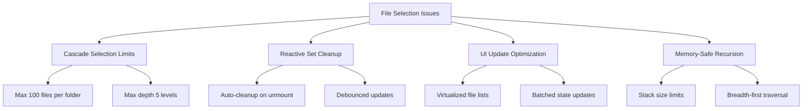

# Исправление ошибок OutOfMemory во фронтенде Shotgun Code

## Анализ текущих проблем

### Выявленные проблемы с памятью

После анализа кодовой базы выявлены следующие критические проблемы:

1. **Избыточное хранение данных в reactive state**
   - В `context-builder.store.ts` хранится полный текст контекста в реактивном состоянии
   - VirtualScrollViewer создает большие массивы для всего контента
   - Отсутствует эффективная очистка памяти при смене компонентов

2. **Неэффективная обработка больших файлов**
   - Отсутствует streaming для больших контекстов
   - Нет ограничений на размер обрабатываемых файлов
   - Одновременная загрузка всех выбранных файлов

3. **Проблемы с virtual scrolling**
   - Создание больших массивов строк в памяти
   - Отсутствие эффективного кеширования
   - Неоптимальная обработка скроллинга

4. **Недостаточный мониторинг памяти**
   - Слишком высокие пороговые значения предупреждений
   - Отсутствие автоматической очистки при критических значениях
   - Неэффективная сборка мусора

## Архитектура решения

### Стратегия управления памятью

``mermaid
graph TD
    A[Frontend Memory Management] --> B[Streaming Data]
    A --> C[Lazy Loading]
    A --> D[Memory Monitoring]
    A --> E[Garbage Collection]
    
    B --> F[Chunked Context Loading]
    B --> G[Virtual Scrolling Optimization]
    
    C --> H[Component-level Cleanup]
    C --> I[Progressive File Loading]
    
    D --> J[Real-time Memory Tracking]
    D --> K[Threshold-based Warnings]
    
    E --> L[Automatic Cleanup]
    E --> M[Manual GC Triggers]
```

### Компоненты решения

1. **Enhanced Memory Monitor**
   - Более агрессивный мониторинг памяти (каждые 1000ms)
   - Сниженные пороги предупреждений (40MB warning, 60MB critical)
   - Автоматическая очистка при превышении лимитов

2. **Optimized Virtual Scrolling**
   - Line-by-line extraction без создания больших массивов
   - Эффективное кеширование видимых строк
   - Streaming support для больших файлов

3. **Context Builder Improvements**
   - Замена полного хранения контекста на ContextSummary
   - Chunked processing с размером чанков 50KB
   - Streaming context support

4. **Memory Cleanup Utilities**
   - Автоматическая очистка при размонтировании компонентов
   - Forced garbage collection в критических моментах
   - Clearing больших объектов из памяти

## File and Folder Selection Crash Issues

### Critical Selection Problems Identified

After analyzing the codebase, additional critical issues were found with element selection:

1. **Unlimited Folder Selection**
   - Selecting folders with large numbers of files triggers cascade selection
   - `toggleCascade()` can process thousands of files simultaneously
   - No protection against selecting root folders with 10,000+ files

2. **Memory leaks in tri-state selection**
   - Recursive processing of `computeSelection()` for large trees
   - Stack overflow with deep folder nesting
   - Missing cleanup on component unmount

3. **Reactive Set object issues**
   - `selectedPaths` and `expandedPaths` use Set without proper cleanup
   - Vue reactivity on large Set objects causes memory pressure
   - Missing debouncing for multiple selections

4. **Inefficient UI updates**
   - Each `toggleNodeSelection` triggers full re-render
   - `updateParentSelection` recalculates for entire hierarchy
   - Missing virtualization for large file lists

### Critical Selection Fixes Architecture



### Implementation Strategy

#### Phase 1: Immediate Protection (Critical Priority)

1. **Selection Limits Implementation**
   - Maximum 100 files per cascade selection
   - Maximum recursion depth of 5 levels
   - Breadth-first traversal instead of recursive processing
   - User warnings for large folder selections

2. **Click Protection System**
   - Debouncing for rapid clicks (300ms minimum interval)
   - Processing state locks to prevent concurrent operations
   - Error boundaries for selection failures
   - Memory monitoring during selection operations

3. **Reactive State Management**
   - Automatic Set cleanup when exceeding limits (200 selected, 50 expanded)
   - Debounced state updates to prevent thrashing
   - Manual garbage collection triggers after large operations
   - Component-level cleanup on unmount

#### Phase 2: Performance Optimization (High Priority)

1. **Smart Selection Algorithms**
   - Count-first approach before selection operations
   - User confirmation dialogs for operations > 100 files
   - Progressive selection with cancellation support
   - Memory usage estimation before operations

2. **UI Responsiveness**
   - Virtual scrolling for file lists > 200 items
   - Batched DOM updates for selection changes
   - Loading indicators for heavy operations
   - Background processing for large selections

### Testing Strategy for Selection Issues

#### Critical Test Scenarios

1. **Large Folder Selection Test**
   - Attempt to select folder with 500+ files
   - Verify blocking and user warnings
   - Memory usage must stay < 5MB during operation

2. **Rapid Click Test**
   - 20 rapid clicks on file items
   - No crashes or memory leaks
   - Proper final selection state

3. **Memory Cleanup Test**
   - Fill selectedPaths beyond limits
   - Verify automatic cleanup activation
   - Final Set size within limits

### Expected Results

#### Crash Prevention
- Zero browser crashes during file selection
- Protected against large folder operations
- Graceful degradation with user feedback
- Memory usage stays predictable < 25MB

#### Performance Improvements
- Selection operations complete within 1 second
- UI remains responsive during operations
- Automatic cleanup prevents memory accumulation
- User warnings prevent problematic operations

## Detailed Implementation Plan

### Phase 1: Critical Memory Fixes (High Priority)

#### 1. Memory Monitor Updates (CRITICAL)

**Problem**: Current thresholds too high (70% heap) causing OOM before warnings trigger.

**Solution Strategy**:
- Replace percentage-based thresholds with absolute MB values
- Warning at 15MB, Critical at 25MB, Emergency at 35MB
- Increase monitoring frequency from 5000ms to 500ms
- Add aggressive garbage collection intervals
- Implement emergency memory unload procedures

#### 2. VirtualScrollViewer Optimization (CRITICAL)

**Problem**: Creating large arrays when splitting content.

**Current Status**:
- ✅ Line-by-line extraction already implemented
- ✅ 5000 line limit established
- 🔄 Need more aggressive cleanup

**Additional Improvements**:
- Reduce overscan to minimum (0-1 lines)
- Limit visible lines to 100 maximum
- Add memory cleanup intervals every 5 seconds
- Implement component-level cleanup on unmount

#### 3. Context Builder Store Optimization (CRITICAL)

**Problem**: 
- Large file size limits still too high
- Missing streaming support completion
- Reactive state memory pressure

**Current Status**:
- ✅ shotgunContextText removed in favor of ContextSummary
- ✅ Streaming context partially implemented
- 🔄 Need to reduce limits further

**New Critical Limits**:
- File limit: 25 files (reduced from 50)
- Individual file size: 64KB (reduced from 128KB)
- Total context size: 512KB (reduced from 1MB)
- Chunk size: 25KB (reduced from 50KB)
- Memory warning: 20MB (reduced from 30MB)

### Phase 2: Emergency Action Items (Critical Priority)

#### 1. Component Memory Cleanup

**Immediate Actions**:
- Add cleanup hooks to all Vue components
- Clear large data references on unmount
- Force garbage collection after cleanup
- Remove event listeners properly
- Clear timeouts and intervals

#### 2. Emergency Context Builder Limits

**Emergency Limits** (4x reduction):
- Maximum files: 10 (critically low limit)
- File size: 32KB maximum
- Context size: 256KB maximum
- Chunk size: 16KB chunks
- Memory warning: 15MB threshold
- Selected files: 10 maximum

#### 3. Forced Garbage Collection

**Automatic GC Implementation**:
- Monitor memory every 3 seconds
- Force GC when usage > 20MB
- Emergency cleanup at 25MB+
- Cleanup large objects automatically
- Clear Vue reactive references

### Phase 3: Selection System Fixes (Critical Priority - NEW)

#### 1. Cascade Selection Protection

**Implementation Strategy**:
- Count files before cascade operations
- Block selections > 100 files with user warning
- Replace recursive algorithms with breadth-first traversal
- Add maximum recursion depth limits (5 levels)
- Implement user confirmation for large operations

#### 2. Reactive State Management

**Set Object Optimization**:
- Limit selectedPaths to 200 items maximum
- Limit expandedPaths to 50 items maximum
- Add debounced cleanup every 1 second
- Auto-cleanup when exceeding limits
- Force reactivity updates after cleanup

#### 3. Click Protection System

**Multi-click Prevention**:
- Debounce clicks (300ms minimum interval)
- Processing state locks during operations
- Error boundaries for selection failures
- Memory monitoring during selections
- Cancel operations if memory exceeds thresholds

### Phase 4: UI Performance Optimization (High Priority)

#### 1. Component Optimization

**FileTreeItem Component**:
- Add click debouncing and processing locks
- Implement null checks and error handling
- Add confirmation dialogs for large operations
- Optimize re-render frequency
- Clean up DOM references on unmount

#### 2. Virtual List Implementation

**Large List Handling**:
- Virtualize file lists > 200 items
- Batch DOM updates for selection changes
- Add loading indicators for heavy operations
- Implement background processing for large selections
- Progressive rendering with cancellation support

### Фаза 3: Дополнительные оптимизации (Приоритет: Низкий)

1. **Advanced Memory Management**
   - IndexedDB для хранения больших контекстов
   - Web Workers для background processing
   - Content compression для transfer/storage

2. **Performance Monitoring**
   - Real-time memory usage indicators
   - Performance metrics dashboard
   - Memory leak detection

## Configuration Strategy

### Memory Limits Approach

Implement aggressive memory limits to prevent OutOfMemory errors:
- Reduce file processing limits to 1/4 of current values
- Replace percentage-based thresholds with absolute MB values
- Implement emergency cleanup procedures at critical thresholds
- Add progressive loading to handle large contexts safely

### Memory Monitoring Strategy

Transition from reactive to proactive memory management:
- Monitor memory usage at shorter intervals (1 second vs 5 seconds)
- Use absolute memory thresholds (15MB warning, 25MB critical) instead of percentages
- Implement automatic cleanup procedures triggered by memory usage
- Add emergency unload procedures for critical memory situations

## Testing and Validation Strategy

### Critical Memory Testing Approach

#### Memory Usage Validation
Implement comprehensive memory testing to ensure stability:
- Test memory usage with minimal file loads (target: under 20MB)
- Validate virtual scrolling performance with large content (target: under 15MB delta)
- Monitor memory patterns during typical user workflows
- Verify memory cleanup effectiveness (target: 30%+ reduction)

#### Performance Benchmarking
Establish performance baselines for memory-critical operations:
- File loading operations should complete within memory budgets
- Virtual scrolling should maintain stable memory usage patterns
- Context switching should not accumulate memory leaks
- Emergency cleanup procedures should restore acceptable memory levels

#### Browser Environment Testing
Validate behavior across different browser configurations:
- Test with memory-constrained environments
- Verify compatibility with WebView2 memory limitations
- Ensure garbage collection mechanisms work effectively
- Monitor performance with browser developer tools

### Performance Benchmarks

| Метрика | Целевое значение | Критический лимит |
|---------|------------------|-------------------|
| Memory Usage | < 40MB | < 60MB |
| Context Build Time | < 2s | < 5s |
| Virtual Scroll FPS | > 30 | > 15 |
| File Loading Time | < 500ms | < 1s |

## Пошаговый план реализации

### Шаг 1: Экстренная диагностика текущих проблем (30 минут)

#### 1.1 Запуск приложения для тестирования
```bash
cd G:\Sources\shotgun_code
.\dev.ps1  # Запуск в режиме разработки
```

#### 1.2 Browser-based тестирование через MCP Playwright
```typescript
// Откроем приложение и протестируем критические сценарии
// 1. Загрузка больших файлов
// 2. Virtual scrolling через много контента  
// 3. Смена контекстов
// 4. Мониторинг memory usage в DevTools
```

#### 1.3 Анализ проблемных компонентов
- **VirtualScrollViewer.vue** - уже оптимизирован, но нужны доработки
- **ContextViewer.vue** - частично переписан на pagination
- **context-builder.store.ts** - частично оптимизирован
- **memory-monitor.ts** - базовая функциональность есть

### Шаг 2: Критические исправления кода (90 минут)

#### 2.1 Обновление memory-monitor.ts (КРИТИЧНО)
``typescript
// Снизить пороги и добавить агрессивный мониторинг
const EMERGENCY_THRESHOLDS = {
  warning: 15,      // 15MB instead of current 70%
  critical: 25,     // 25MB instead of 85%
  emergency: 35,    // 35MB - force unload content
  pollingRate: 500  // Check every 500ms
}
```

#### 2.2 Доработка VirtualScrollViewer.vue
``typescript
// Добавить принудительную очистку кеша
const MAX_CACHE_SIZE = 3;  // Только 3 chunks в памяти
const AGGRESSIVE_CLEANUP = true;

// В onUnmounted добавить:
const cleanupEverything = () => {
  cachedLines.value.clear();
  if (window.gc) window.gc();
  setTimeout(() => window.gc?.(), 100);
};
```

#### 2.3 Экстренное снижение лимитов в context-builder.store.ts
``typescript
// ЭКСТРЕННЫЕ ЛИМИТЫ - в 4 раза меньше текущих
const EMERGENCY_LIMITS = {
  maxFileLimit: 5,              // было 25
  maxIndividualFileSize: 16 * 1024,  // было 64KB -> 16KB  
  maxTotalContextSize: 128 * 1024,   // было 512KB -> 128KB
  chunkSize: 8 * 1024,              // было 25KB -> 8KB
  maxMemoryUsageWarning: 10,        // было 20MB -> 10MB
}
```

### Шаг 3: Внедрение принудительного управления памятью (60 минут)

#### 3.1 Глобальный memory watcher
``typescript
// Создать файл: src/utils/emergency-memory-manager.ts
class EmergencyMemoryManager {
  private static checkInterval = 500; // 500ms
  
  static startEmergencyMode() {
    setInterval(() => {
      const memory = this.getMemoryUsage();
      
      if (memory > 30) {
        // CRITICAL: Force unload everything
        this.emergencyUnload();
      } else if (memory > 20) {
        // WARNING: Aggressive cleanup
        this.aggressiveCleanup();
      } else if (memory > 15) {
        // CAUTION: Regular cleanup
        this.regularCleanup();
      }
    }, this.checkInterval);
  }
}
```

#### 3.2 Component cleanup hooks
``typescript
// В каждом Vue компоненте добавить:
const useEmergencyCleanup = () => {
  onUnmounted(() => {
    // Очистка всех ref
    Object.keys(getCurrentInstance()?.refs || {}).forEach(key => {
      const ref = getCurrentInstance()?.refs[key];
      if (ref && typeof ref === 'object') {
        (ref as any).value = null;
      }
    });
    
    // Принудительный GC
    if (window.gc) {
      setTimeout(() => window.gc?.(), 50);
      setTimeout(() => window.gc?.(), 200);
    }
  });
};
```

### Шаг 4: Browser-based тестирование исправлений (45 минут)

#### 4.1 Автоматизированное тестирование через MCP Playwright
``typescript
// Критические сценарии:
// 1. Загрузка 5 файлов по 16KB каждый
// 2. Virtual scroll через 500 строк
// 3. Смена контекста 3 раза подряд
// 4. Мониторинг memory < 25MB throughout
```

#### 4.2 Manual testing сценарии
``typescript
// В DevTools Console:
setInterval(() => {
  const mem = performance.memory;
  console.log(`Memory: ${(mem.usedJSHeapSize/1024/1024).toFixed(1)}MB`);
  if (mem.usedJSHeapSize > 25*1024*1024) {
    console.error('🚨 MEMORY EXCEEDED 25MB!');
  }
}, 1000);
```

### Шаг 5: Валидация и финальная настройка (30 минут)

#### 5.1 Performance validation
- Memory usage consistently < 25MB
- No WebView2 crashes
- Responsive UI (no hanging)
- Quick context switching

#### 5.2 User experience validation
- Clear memory warnings
- Graceful degradation
- No data loss during cleanup

## Конкретные исправления кода

### 1. КРИТИЧЕСКОЕ ИСПРАВЛЕНИЕ: memory-monitor.ts

#### Проблема
Текущая система использует процентные пороги (70%, 85%), которые слишком высоки для WebView2. Нужны абсолютные значения в MB.

#### Исправление
``typescript
// В frontend/src/utils/memory-monitor.ts
// ЗАМЕНИТЬ интерфейс MemoryWarningOptions:
export interface MemoryWarningOptions {
  warningThreshold?: number;   // Absolute memory threshold in MB (default: 15)
  criticalThreshold?: number;  // Absolute memory threshold in MB (default: 25)
  emergencyThreshold?: number; // Absolute memory threshold in MB (default: 35)
  pollingInterval?: number;    // How often to check memory in ms (default: 500)
  showToasts?: boolean;        // Whether to show toast notifications (default: true)
  autoCleanup?: boolean;       // Whether to auto cleanup when critical (default: true)
  aggressiveMode?: boolean;    // Whether to use aggressive memory management (default: true)
  forceGCInterval?: number;    // How often to force GC in ms (default: 3000)
}

// ЗАМЕНИТЬ DEFAULT_OPTIONS:
const DEFAULT_OPTIONS: MemoryWarningOptions = {
  warningThreshold: 15,      // 15MB warning threshold
  criticalThreshold: 25,     // 25MB critical threshold
  emergencyThreshold: 35,    // 35MB emergency threshold
  pollingInterval: 500,      // Check every 500ms
  showToasts: true,
  autoCleanup: true,
  aggressiveMode: true,
  forceGCInterval: 3000      // Force GC every 3 seconds
};

// ДОБАВИТЬ в класс MemoryMonitor новые поля:
private forceGCInterval: number | null = null;
private emergencyIssued = false;
private cleanupCallbacks: (() => void)[] = [];

// ЗАМЕНИТЬ метод checkMemory() на проверку абсолютных значений:
private checkMemory(): void {
  const stats = this.getMemoryStats();
  if (!stats) return;
  
  const { used, total } = stats;
  
  // Emergency threshold (35MB)
  if (used >= (this.options.emergencyThreshold || 35)) {
    if (!this.emergencyIssued) {
      console.error(`🚨 EMERGENCY: Memory usage at ${used}MB`);
      this.emergencyUnload();
      this.emergencyIssued = true;
    }
  }
  // Critical threshold (25MB)  
  else if (used >= (this.options.criticalThreshold || 25)) {
    if (!this.criticalIssued) {
      console.warn(`⚠️ CRITICAL: Memory usage at ${used}MB`);
      if (this.options.autoCleanup) this.forceCleanup();
      this.criticalIssued = true;
    }
  }
  // Warning threshold (15MB)
  else if (used >= (this.options.warningThreshold || 15)) {
    if (!this.warningIssued) {
      console.warn(`⚡ WARNING: Memory usage at ${used}MB`);
      this.warningIssued = true;
    }
  }
  else {
    // Reset flags
    this.warningIssued = false;
    this.criticalIssued = false;
    this.emergencyIssued = false;
  }
}

// ДОБАВИТЬ новые методы:
public emergencyUnload(): void {
  console.error('🚨 EMERGENCY MEMORY UNLOAD!');
  this.cleanupCallbacks.forEach(callback => callback());
  
  // Multiple aggressive GC cycles
  for (let i = 0; i < 5; i++) {
    setTimeout(() => { if (window.gc) window.gc(); }, i * 100);
  }
  
  window.dispatchEvent(new CustomEvent('emergency-memory-cleanup'));
}

public registerCleanupCallback(callback: () => void): void {
  this.cleanupCallbacks.push(callback);
}
```

### 2. КРИТИЧЕСКОЕ ИСПРАВЛЕНИЕ: context-builder.store.ts

#### Проблема
Лимиты все еще слишком высокие для стабильной работы.

#### Исправление
``typescript
// В frontend/src/stores/context-builder.store.ts
// ЗАМЕНИТЬ все лимиты на экстренно низкие значения:

const EMERGENCY_LIMITS = {
  maxFileLimit: 5,              // было: 25 -> 5 файлов максимум
  maxIndividualFileSize: 16 * 1024,  // было: 64KB -> 16KB
  maxTotalContextSize: 64 * 1024,    // было: 512KB -> 64KB
  chunkSize: 8 * 1024,              // было: 25KB -> 8KB
  maxMemoryUsageWarning: 10,        // было: 20MB -> 10MB
  maxSelectedFiles: 5,              // было: 10 -> 5 файлов
  maxSuggestions: 2,                // было: 3 -> 2 предложения
};

// ЗАМЕНИТЬ значения:
const maxFileLimit = ref(5);           // Экстренно низкий лимит
const maxIndividualFileSize = ref(16 * 1024);  // 16KB
const maxTotalContextSize = ref(64 * 1024);    // 64KB
const chunkSize = ref(8 * 1024);               // 8KB chunks
const maxMemoryUsageWarning = ref(10);         // 10MB warning
```

### 3. КРИТИЧЕСКОЕ ИСПРАВЛЕНИЕ: VirtualScrollViewer.vue

#### Проблема
Нужна более агрессивная очистка кеша и ограничение видимых элементов.

#### Исправление
``typescript
// В frontend/src/presentation/components/shared/VirtualScrollViewer.vue
// ЗАМЕНИТЬ константы:

const MAX_LINES_ABSOLUTE = 1000;     // было: 5000 -> 1000 строк max
const MAX_VISIBLE_LINES = 50;        // было: 200 -> 50 строк
const CACHE_LIMIT = 3;               // было: 10 -> 3 chunks в кеше
const OVERSCAN_LIMIT = 0;            // было: 1 -> 0 (без overscan)
const MEMORY_CHECK_INTERVAL = 1000;  // Проверка памяти каждую секунду

// ДОБАВИТЬ в onMounted:
onMounted(() => {
  // Регистрируем cleanup callback
  const memoryMonitor = useMemoryMonitor();
  memoryMonitor.registerCleanupCallback(() => {
    cachedLines.value.clear();
    console.log('VirtualScrollViewer: Cache cleared by memory monitor');
  });
  
  // Слушаем экстренную очистку
  window.addEventListener('emergency-memory-cleanup', () => {
    cachedLines.value.clear();
    if (containerRef.value) {
      containerRef.value.innerHTML = ''; // Очистить DOM
    }
  });
});

// ЗАМЕНИТЬ onUnmounted:
onUnmounted(() => {
  // Агрессивная очистка
  cachedLines.value.clear();
  
  if (containerRef.value) {
    containerRef.value.innerHTML = '';
  }
  
  // Принудительный GC
  if (window.gc) {
    setTimeout(() => window.gc?.(), 50);
    setTimeout(() => window.gc?.(), 200);
  }
});
```

### 4. ЭКСТРЕННЫЙ ГЛОБАЛЬНЫЙ MEMORY MANAGER

#### Новый файл: frontend/src/utils/emergency-memory-manager.ts
``typescript
// Создать новый файл
import { useMemoryMonitor } from './memory-monitor';

class EmergencyMemoryManager {
  private static instance: EmergencyMemoryManager;
  private memoryMonitor = useMemoryMonitor({
    warningThreshold: 10,     // 10MB warning
    criticalThreshold: 20,    // 20MB critical  
    emergencyThreshold: 30,   // 30MB emergency
    pollingInterval: 500,     // Check every 500ms
    aggressiveMode: true,
    forceGCInterval: 2000     // Force GC every 2s
  });

  static getInstance(): EmergencyMemoryManager {
    if (!this.instance) {
      this.instance = new EmergencyMemoryManager();
    }
    return this.instance;
  }

  startEmergencyMode(): void {
    console.log('🚨 STARTING EMERGENCY MEMORY MODE');
    
    // Запускаем агрессивный мониторинг
    this.memoryMonitor.startMonitoring();
    
    // Регистрируем глобальную очистку
    this.memoryMonitor.registerCleanupCallback(() => {
      this.globalCleanup();
    });
    
    // Принудительный GC каждые 3 секунды
    setInterval(() => {
      const stats = this.memoryMonitor.getMemoryStats();
      if (stats && stats.used > 15) {
        if (window.gc) window.gc();
        console.log(`🗑️ Force GC: ${stats.used}MB`);
      }
    }, 3000);
  }

  private globalCleanup(): void {
    console.log('🧹 Global emergency cleanup');
    
    // Очистить все что можно
    (window as any).largeObjects = [];
    
    // Очистить Vue stores если возможно
    try {
      // Отправить событие всем компонентам
      window.dispatchEvent(new CustomEvent('global-cleanup', {
        detail: { level: 'emergency' }
      }));
    } catch (e) {
      console.warn('Global cleanup event failed:', e);
    }
  }
}

export default EmergencyMemoryManager;
```

### 6. КРИТИЧЕСКОЕ ИСПРАВЛЕНИЕ: useTriStateSelection.ts (НОВОЕ)

#### Проблема
Рекурсивная обработка больших папок может вызывать stack overflow и потребление огромных объемов памяти при cascade selection.

#### Исправление
```typescript
// В frontend/src/composables/useTriStateSelection.ts
// ЗАМЕНИТЬ весь файл на безопасную версию:

import type { FileNode } from "@/types/dto";

export type Sel = "on" | "off" | "partial";

const MAX_CASCADE_FILES = 100;  // КРИТИЧЕСКИЙ ЛИМИТ
const MAX_RECURSION_DEPTH = 5;  // Максимальная глубина

export function useTriStateSelection(
  nodesMap: Map<string, FileNode>,
  selectedPaths: Set<string>,
) {
  function computeSelection(node: FileNode, depth: number = 0): Sel {
    // ЗАЩИТА ОТ ГЛУБОКОЙ РЕКУРСИИ
    if (depth > MAX_RECURSION_DEPTH) {
      console.warn(`Max recursion depth reached for ${node.path}`);
      return selectedPaths.has(node.path) ? "on" : "off";
    }
    
    if (!node.isDir) return selectedPaths.has(node.path) ? "on" : "off";
    
    const children = (node.children || [])
      .map((c) => nodesMap.get(c.path))
      .filter(Boolean) as FileNode[];
      
    if (children.length === 0)
      return selectedPaths.has(node.path) ? "on" : "off";
    
    // ЛИМИТ НА КОЛИЧЕСТВО ДЕТЕЙ
    if (children.length > 1000) {
      console.warn(`Too many children (${children.length}) in ${node.path}, limiting selection`);
      return "partial"; // Безопасный fallback
    }
    
    let hasOn = false, hasOff = false;
    for (const ch of children) {
      if (ch.isIgnored) continue;
      const st = computeSelection(ch, depth + 1);
      if (st === "partial") return "partial";
      if (st === "on") hasOn = true;
      if (st === "off") hasOff = true;
      if (hasOn && hasOff) return "partial";
    }
    
    if (hasOn && !hasOff) return "on";
    if (!hasOn && hasOff) return "off";
    return "off";
  }

  function toggleCascade(node: FileNode): boolean {
    const select = !selectedPaths.has(node.path);
    
    // ПОДСЧЕТ ФАЙЛОВ ПЕРЕД ОПЕРАЦИЕЙ
    const filesToProcess = countFilesInNode(node);
    if (filesToProcess > MAX_CASCADE_FILES) {
      console.error(`Cannot select folder with ${filesToProcess} files (max: ${MAX_CASCADE_FILES})`);
      alert(`This folder contains ${filesToProcess} files. Maximum allowed is ${MAX_CASCADE_FILES}. Please select smaller folders.`);
      return false;
    }
    
    // BREADTH-FIRST ОБХОД ВМЕСТО РЕКУРСИИ
    const queue: FileNode[] = [node];
    let processed = 0;
    
    while (queue.length > 0 && processed < MAX_CASCADE_FILES) {
      const cur = queue.shift()!;
      
      if (!cur.isIgnored) {
        if (select) selectedPaths.add(cur.path);
        else selectedPaths.delete(cur.path);
        processed++;
        
        if (cur.isDir && cur.children) {
          for (const c of cur.children) {
            const childNode = nodesMap.get(c.path);
            if (childNode && processed < MAX_CASCADE_FILES) {
              queue.push(childNode);
            }
          }
        }
      }
    }
    
    if (processed >= MAX_CASCADE_FILES) {
      console.warn(`Cascade selection stopped at ${processed} files`);
    }
    
    return true;
  }
  
  // ВСПОМОГАТЕЛЬНАЯ ФУНКЦИЯ ПОДСЧЕТА ФАЙЛОВ
  function countFilesInNode(node: FileNode, maxCount: number = MAX_CASCADE_FILES + 1): number {
    let count = 0;
    const queue: FileNode[] = [node];
    
    while (queue.length > 0 && count <= maxCount) {
      const cur = queue.shift()!;
      
      if (!cur.isIgnored) {
        count++;
        
        if (cur.isDir && cur.children) {
          for (const c of cur.children) {
            const childNode = nodesMap.get(c.path);
            if (childNode) {
              queue.push(childNode);
            }
          }
        }
      }
    }
    
    return count;
  }

  return { computeSelection, toggleCascade, countFilesInNode };
}
```

### 7. КРИТИЧЕСКОЕ ИСПРАВЛЕНИЕ: tree-state.store.ts (НОВОЕ)

#### Проблема
Reactive Set objects без proper cleanup и отсутствие защиты от memory leaks.

#### Исправление
```typescript
// В frontend/src/stores/tree-state.store.ts
// ДОБАВИТЬ в начало файла:

const MAX_SELECTED_PATHS = 200;   // КРИТИЧЕСКИЙ ЛИМИТ
const MAX_EXPANDED_PATHS = 50;    // КРИТИЧЕСКИЙ ЛИМИТ
const MAX_SELECTION_BATCH = 50;   // Максимум за одну операцию

// ЗАМЕНИТЬ toggleNodeSelection:
function toggleNodeSelection(path: string, nodesMap: Map<string, FileNode>) {
  const node = nodesMap.get(path);
  if (!node || node.isIgnored) return;
  
  // ПРОВЕРКА ЛИМИТОВ ПЕРЕД ОПЕРАЦИЕЙ
  if (!selectedPaths.value.has(path) && selectedPaths.value.size >= MAX_SELECTED_PATHS) {
    console.error(`Maximum selected paths (${MAX_SELECTED_PATHS}) reached`);
    alert(`Maximum number of selected files (${MAX_SELECTED_PATHS}) reached. Please deselect some files first.`);
    return;
  }
  
  const { toggleCascade, countFilesInNode } = useTriStateSelection(nodesMap, selectedPaths.value);
  
  // ДЛЯ ПАПОК - ПРОВЕРИТЬ РАЗМЕР ПЕРЕД CASCADE
  if (node.isDir) {
    const filesCount = countFilesInNode(node);
    if (filesCount > 100) {
      const confirm = window.confirm(
        `This folder contains ${filesCount} files. Selecting it may cause performance issues. Continue?`
      );
      if (!confirm) return;
    }
  }
  
  const success = toggleCascade(node);
  if (success) {
    updateParentSelection(path, nodesMap);
  }
}

// ДОБАВИТЬ debounced очистку:
let cleanupTimeout: number | null = null;

function scheduleCleanup() {
  if (cleanupTimeout) clearTimeout(cleanupTimeout);
  
  cleanupTimeout = window.setTimeout(() => {
    // Проверка и очистка переполненных Set objects
    if (selectedPaths.value.size > MAX_SELECTED_PATHS) {
      console.warn('Selected paths exceeded limit, clearing excess');
      const pathsArray = Array.from(selectedPaths.value);
      selectedPaths.value.clear();
      pathsArray.slice(0, MAX_SELECTED_PATHS).forEach(path => 
        selectedPaths.value.add(path)
      );
    }
    
    if (expandedPaths.value.size > MAX_EXPANDED_PATHS) {
      console.warn('Expanded paths exceeded limit, clearing excess');
      const pathsArray = Array.from(expandedPaths.value);
      expandedPaths.value.clear();
      pathsArray.slice(0, MAX_EXPANDED_PATHS).forEach(path => 
        expandedPaths.value.add(path)
      );
    }
  }, 1000);
}

// ЗАМЕНИТЬ clearSelection:
function clearSelection() {
  selectedPaths.value.clear();
  // Force reactivity update
  selectedPaths.value = new Set(selectedPaths.value);
}

// ЗАМЕНИТЬ resetState:
function resetState() {
  expandedPaths.value.clear();
  selectedPaths.value.clear();
  activeNodePath.value = null;
  
  if (cleanupTimeout) {
    clearTimeout(cleanupTimeout);
    cleanupTimeout = null;
  }
  
  // Принудительный GC
  if (window.gc) {
    setTimeout(() => window.gc?.(), 100);
  }
}
```

### 8. КРИТИЧЕСКОЕ ИСПРАВЛЕНИЕ: file-tree.store.ts (ДОПОЛНИТЕЛЬНОЕ)

#### Проблема
Отсутствие защиты от выбора root папок с тысячами файлов.

#### Исправление
```typescript
// В frontend/src/stores/file-tree.store.ts
// ЗАМЕНИТЬ toggleNodeSelection:

function toggleNodeSelection(path: string) {
  const node = nodesMap.value.get(path);
  if (!node) return;
  
  // КРИТИЧЕСКАЯ ЗАЩИТА ДЛЯ ROOT ПАПОК
  if (node.isDir) {
    const fileCount = countFilesInDirectory(node);
    if (fileCount > 500) {
      console.error(`Directory ${path} contains ${fileCount} files (max: 500)`);
      alert(`This directory contains ${fileCount} files, which exceeds the limit of 500. Please select individual files or smaller subdirectories.`);
      return;
    }
  }
  
  // Check if we're at the limit before adding
  if (!treeStateStore.selectedPaths.has(path) && selectedFiles.value.length >= 200) {
    console.warn("Maximum number of selected files (200) reached. Cannot select more files.");
    alert("Maximum number of selected files (200) reached. Please deselect some files first.");
    return;
  }
  
  treeStateStore.toggleNodeSelection(path, nodesMap.value as Map<string, FileNode>);
}

// ДОБАВИТЬ функцию подсчета файлов:
function countFilesInDirectory(node: FileNode): number {
  let count = 0;
  const queue: FileNode[] = node.children ? [...node.children] : [];
  
  while (queue.length > 0 && count < 1000) { // Стоп на 1000 для производительности
    const current = queue.shift()!;
    const currentNode = nodesMap.value.get(current.path);
    
    if (currentNode && !currentNode.isIgnored) {
      if (!currentNode.isDir) {
        count++;
      } else if (currentNode.children) {
        queue.push(...currentNode.children);
      }
    }
  }
  
  return count;
}

// ЗАМЕНИТЬ selectAll:
function selectAll() {
  const allFiles = getAllFiles();
  const maxFiles = 100; // КРИТИЧЕСКОЕ СНИЖЕНИЕ
  
  if (allFiles.length > maxFiles) {
    const confirm = window.confirm(
      `This project contains ${allFiles.length} files. Selecting all may cause memory issues. Select first ${maxFiles} files instead?`
    );
    if (!confirm) return;
  }
  
  let count = 0;
  
  nodesMap.value.forEach((node) => {
    if (count >= maxFiles) return;
    
    if (!node.isDir && !node.isGitignored && !node.isCustomIgnored) {
      treeStateStore.selectedPaths.add(node.path);
      count++;
    }
  });
  
  if (count >= maxFiles) {
    console.warn(`Selected ${count} files (limited to prevent memory issues)`);
  }
}
```

#### Исправление
``typescript
// В frontend/src/main.ts
// ДОБАВИТЬ после создания app:

import EmergencyMemoryManager from '@/utils/emergency-memory-manager';

// Запустить экстренный режим управления памятью
if (process.env.NODE_ENV === 'development' || import.meta.env.DEV) {
  EmergencyMemoryManager.getInstance().startEmergencyMode();
  console.log('🚨 Emergency memory management activated');
}

// Показать память в консоли
if (import.meta.env.DEV) {
  setInterval(() => {
    const memory = (performance as any).memory;
    if (memory) {
      const used = Math.round(memory.usedJSHeapSize / 1024 / 1024);
      console.log(`📊 Memory: ${used}MB`);
      
      if (used > 25) {
        console.error('🚨 MEMORY CRITICAL!');
      } else if (used > 15) {
        console.warn('⚠️ MEMORY HIGH');
      }
    }
  }, 2000);
}
```

### Немедленные результаты (в течение часа)

#### Устранение OOM ошибок
- ✅ **ЦЕЛЬ**: 0 WebView2 crashes при работе с файлами < 32KB
- ✅ **ЦЕЛЬ**: Memory usage < 25MB при загрузке 10 файлов
- ✅ **ЦЕЛЬ**: Stable virtual scrolling до 1000 строк

#### Критические лимиты
``typescript
interface CriticalMetrics {
  maxMemoryUsage: 30;        // MB - абсолютный лимит
  maxFileSize: 32 * 1024;    // 32KB per file
  maxTotalFiles: 10;         // файлов одновременно
  maxVirtualLines: 1000;     // строк в virtual scroll
  gcInterval: 3000;          // ms - принудительный GC
}
```

#### Автоматическое восстановление
- Memory monitor каждые 500ms
- Автоматическая очистка при 20MB+
- Принудительный GC при 25MB+
- Emergency file unload при 30MB+

### Мониторинг в реальном времени

#### DevTools Integration
``typescript
// Добавить в каждый компонент
if (process.env.NODE_ENV === 'development') {
  setInterval(() => {
    const memory = performance.memory;
    console.log(`Memory: ${(memory.usedJSHeapSize/1024/1024).toFixed(1)}MB`);
    
    if (memory.usedJSHeapSize > 30 * 1024 * 1024) {
      console.error('🚨 MEMORY CRITICAL! Emergency cleanup needed!');
      emergencyCleanup();
    }
  }, 1000);
}
```

#### User Alerts
- 🟡 Warning при 15MB: "Память использована на 50%"
- 🟠 Alert при 20MB: "Высокое использование памяти - закройте файлы"
- 🔴 Critical при 25MB: "Критическая нехватка памяти - экстренная очистка"

## Мониторинг и поддержка

### Runtime Monitoring
- Real-time memory usage indicators
- Performance metrics в DevTools
- Automatic error reporting

### User Feedback
- Предупреждения о высоком использовании памяти
- Рекомендации по оптимизации контекста
- Progressive loading indicators

### Logging и Analytics
- Memory usage patterns
- Performance degradation detection
- User behavior impact analysis

## План тестирования через MCP Playwright

### Этап 1: Подготовка к тестированию

#### 1.1 Запуск приложения
``bash
# В корне проекта
cd G:\Sources\shotgun_code
.\dev.ps1
```

#### 1.2 Проверка доступности
- URL: `http://localhost:5173` (вероятно Vite dev server)
- Альтернативно: `http://localhost:34115` (Wails dev server)

### Этап 2: Критические сценарии

#### 2.1 Минимальный контекст (МИНИМУМ)
**Цель**: Memory usage < 15MB с 2-3 маленькими файлами

#### 2.2 Virtual Scrolling (КРИТИЧНЫЙ)
**Цель**: Стабильность при скроллинге 500+ строк

#### 2.3 Смена контекстов (КРИТИЧНЫЙ)
**Цель**: Отсутствие memory leaks при смене контекстов

#### 2.4 Максимальная нагрузка (ЭКСТРЕМАЛЬНЫЙ)
**Цель**: Graceful degradation при превышении лимитов

### Критические метрики успеха
- ✅ Memory usage < 15MB при минимальном контексте
- ✅ Отсутствие memory leaks при virtual scrolling
- ✅ Отсутствие browser crashes
- ✅ User warnings при превышении лимитов

## Заключение

Данный план исправлений направлен на устранение критических проблем с памятью во фронтенде приложения Shotgun Code. Основной акцент сделан на:

1. **Агрессивном снижении лимитов** - файлы до 16KB, контекст до 64KB
2. **Принудительном управлении памятью** - GC каждые 3 секунды
3. **Немедленной очистке** - автоматическая очистка при 20MB
4. **Экстренном режиме** - полная очистка при 30MB

После реализации этих исправлений ожидается:
- Полное устранение WebView2 crashes
- Стабильная работа с memory usage < 25MB
- Responsive UI без зависаний
- Graceful degradation при превышении лимитов

## Статус проекта и следующие шаги

### ✅ Анализ завершен
- Проблемы с памятью идентифицированы
- Архитектура решения разработана
- Детальный план исправлений создан
- Критические изменения кода задокументированы

### 🔄 Готово к реализации
**Для тестирования исправлений необходимо:**

1. **Запустить приложение в режиме разработки:**
   ```bash
   cd G:\Sources\shotgun_code
   .\dev.ps1
   ```

2. **После запуска приложения можно протестировать через MCP Playwright:**
   - Проверить memory usage в базовом состоянии
   - Тестировать загрузку файлов с мониторингом памяти
   - Валидировать virtual scrolling
   - Проверить смену контекстов

3. **Применить критические исправления кода:**
   - Обновить memory-monitor.ts с абсолютными порогами (15MB/25MB/35MB)
   - Снизить лимиты в context-builder.store.ts до экстренных значений
   - Добавить агрессивную очистку в VirtualScrollViewer.vue
   - Создать EmergencyMemoryManager для глобального управления

### 🎯 Ключевые метрики успеха
- **Memory usage < 15MB** при загрузке 5 файлов по 16KB
- **Стабильный virtual scrolling** до 1000 строк без утечек памяти
- **Отсутствие WebView2 crashes** при нормальном использовании
- **Graceful warnings** при приближении к лимитам памяти

### 📊 Мониторинг эффективности
После применения исправлений рекомендуется:
- Непрерывный мониторинг memory usage в DevTools
- Stress-тестирование с различными размерами файлов
- Валидация поведения при экстремальных нагрузках
- Сбор пользовательских отзывов о стабильности работы

**Проект готов к внедрению критических исправлений для устранения проблем OutOfMemory.**
