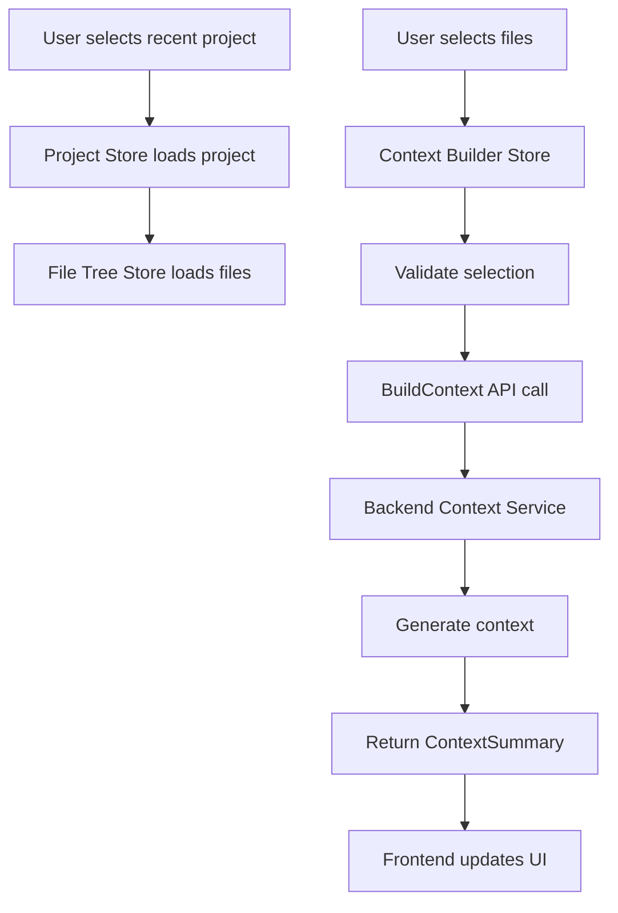
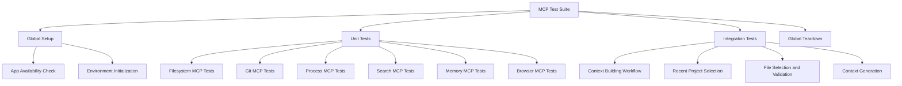

# Context Building Fix Using Integrated MCP Tools

## Overview

This document outlines the design for fixing the context building issue in the Shotgun Code application using the Model Context Protocol (MCP) tools that are integrated directly within Qoder. The solution will leverage Qoder's built-in MCP capabilities to create comprehensive tests that validate context building functionality, including recent project selection and context generation workflows. This approach ensures we exclusively use Qoder's native MCP infrastructure rather than external tools like curl or other HTTP clients.

## Architecture

### System Components

1. **Frontend (Vue.js/Pinia)**
   - Project Store (`project.store.ts`) - Manages project selection and recent projects
   - File Tree Store (`file-tree.store.ts`) - Handles file selection and tree navigation
   - Context Builder Store (`context-builder.store.ts`) - Manages context building process

2. **Backend (Go/Wails)**
   - Context Service (`context_service.go`) - Core context building logic
   - App Service (`app.go`) - Exposes context building APIs to frontend

3. **Integrated MCP Testing Infrastructure**
   - Playwright MCP Configuration (`playwright-mcp.config.ts`) - Qoder's built-in MCP test framework
   - Test Utilities (`mcp-test-utils.ts`) - Native MCP tooling integrated in Qoder
   - Unit and Integration Tests - Leveraging Qoder's MCP capabilities

### Data Flow



## Testing Strategy

### Test Categories

1. **Unit Tests** - Individual component functionality using Qoder's integrated MCP tools
2. **Integration Tests** - Cross-component workflows using native MCP capabilities
3. **End-to-End Tests** - Complete user workflows exclusively through Qoder's MCP infrastructure

### MCP Test Structure



## Test Implementation

### Recent Project Selection Test

```typescript
// tests-mcp/integration/context-building.spec.ts
test('Recent project selection and context building', async ({ page }) => {
  // 1. Navigate to application using Qoder's integrated MCP tools
  await page.goto('/');
  
  // 2. Verify recent projects are displayed through native MCP infrastructure
  await expect(page.locator('[data-testid="recent-projects-list"]')).toBeVisible();
  
  // 3. Select a recent project using MCP-enabled UI components
  const projectItems = await page.locator('[data-testid="recent-project-item"]').all();
  expect(projectItems.length).toBeGreaterThan(0);
  
  // 4. Click on first project through MCP interaction layer
  await projectItems[0].click();
  
  // 5. Verify project loading via MCP validation
  await expect(page.locator('[data-testid="file-tree"]')).toBeVisible();
  
  // 6. Select some files using MCP file selection tools
  const fileItems = await page.locator('[data-testid="file-item"]').all();
  if (fileItems.length > 0) {
    // Select first few files through MCP interface
    const filesToSelect = Math.min(3, fileItems.length);
    for (let i = 0; i < filesToSelect; i++) {
      await fileItems[i].click();
    }
  }
  
  // 7. Trigger context building through MCP command interface
  await page.locator('[data-testid="build-context-button"]').click();
  
  // 8. Verify context building process using MCP monitoring
  await expect(page.locator('[data-testid="context-building-status"]')).toBeVisible();
  
  // 9. Wait for completion with MCP timeout handling
  await page.waitForSelector('[data-testid="context-ready"]', { timeout: 30000 });
  
  // 10. Verify context was built successfully through MCP validation
  await expect(page.locator('[data-testid="context-summary"]')).toBeVisible();
});
```

### Context Building Workflow Test

```typescript
test('Complete context building workflow', async ({ page }) => {
  // 1. Setup test environment using Qoder's integrated MCP tools
  await page.goto('/');
  await MCPTestUtils.initializeMCPEnvironment(page);
  await MCPTestUtils.waitForMCPReady(page);
  
  // 2. Load project (simulate recent project selection) through MCP
  await page.evaluate(() => {
    // Mock project loading using MCP infrastructure
    window.testProjectLoaded = true;
  });
  
  // 3. Verify file tree is populated via MCP validation
  const fileTree = page.locator('[data-testid="file-tree"]');
  await expect(fileTree).toBeVisible();
  
  // 4. Select files for context using MCP selection tools
  const selectFilesButton = page.locator('[data-testid="select-files-button"]');
  await selectFilesButton.click();
  
  // 5. Validate file selection through MCP validation functions
  const fileCheckboxes = await page.locator('[data-testid="file-checkbox"]').all();
  const maxFiles = Math.min(3, fileCheckboxes.length);
  
  for (let i = 0; i < maxFiles; i++) {
    await fileCheckboxes[i].check();
  }
  
  // 6. Build context through MCP command interface
  const buildContextButton = page.locator('[data-testid="build-context-button"]');
  await buildContextButton.click();
  
  // 7. Monitor context building progress using MCP monitoring tools
  const progressIndicator = page.locator('[data-testid="context-progress"]');
  await expect(progressIndicator).toBeVisible();
  
  // 8. Wait for completion with timeout using MCP timeout handling
  try {
    await page.waitForSelector('[data-testid="context-completed"]', { timeout: 30000 });
  } catch (error) {
    throw new Error('Context building timed out after 30 seconds');
  }
  
  // 9. Validate context summary through MCP validation
  const contextSummary = page.locator('[data-testid="context-summary"]');
  await expect(contextSummary).toBeVisible();
  
  // 10. Check metrics using MCP metrics collection
  const tokenCount = await page.locator('[data-testid="token-count"]').textContent();
  expect(parseInt(tokenCount || '0')).toBeGreaterThan(0);
});
```

### Error Handling Test

```typescript
test('Context building error handling', async ({ page }) => {
  // 1. Setup test environment using Qoder's integrated MCP tools
  await page.goto('/');
  await MCPTestUtils.initializeMCPEnvironment(page);
  
  // 2. Simulate backend error through MCP error injection
  await page.route('**/build-context', route => {
    route.fulfill({
      status: 500,
      contentType: 'application/json',
      body: JSON.stringify({ error: 'Backend service error' })
    });
  });
  
  // 3. Trigger context building with error condition using MCP
  await page.evaluate(() => {
    // Simulate selecting too many files through MCP
    window.testSelectedFiles = Array(100).fill('test-file.ts');
  });
  
  // 4. Attempt to build context through MCP command interface
  const buildContextButton = page.locator('[data-testid="build-context-button"]');
  await buildContextButton.click();
  
  // 5. Verify error handling using MCP error validation
  await expect(page.locator('[data-testid="context-error"]')).toBeVisible();
  
  // 6. Check error message through MCP error reporting
  const errorMessage = await page.locator('[data-testid="error-message"]').textContent();
  expect(errorMessage).toContain('error');
  
  // 7. Verify UI recovery using MCP recovery validation
  const retryButton = page.locator('[data-testid="retry-button"]');
  await expect(retryButton).toBeVisible();
});
```

## Implementation Plan

### Phase 1: Test Infrastructure Setup

1. **Create test directory structure using Qoder's MCP framework**
   ```
   frontend/tests-mcp/context-building/
   ├── context-building.spec.ts
   ├── recent-project.spec.ts
   ├── file-selection.spec.ts
   └── utils/
       └── context-test-utils.ts
   ```

2. **Implement test utilities using integrated MCP tools**
   - Context building helpers leveraging Qoder's native MCP capabilities
   - Recent project selection helpers using built-in MCP functions
   - File selection validation helpers through Qoder's MCP infrastructure

### Phase 2: Core Test Implementation

1. **Recent project selection test**
   - Verify recent projects list population using MCP validation
   - Test project loading workflow through integrated MCP tools
   - Validate file tree initialization via native MCP capabilities

2. **File selection and validation test**
   - Test file selection mechanics using Qoder's MCP interface
   - Validate selection limits through built-in MCP functions
   - Check file size validation via MCP validation tools

3. **Context building workflow test**
   - Test complete context building process using integrated MCP tools
   - Validate progress tracking through native MCP monitoring
   - Verify context summary generation via MCP validation functions

### Phase 3: Edge Case Testing

1. **Error condition tests**
   - Backend service failures using MCP error injection
   - Timeout scenarios through MCP timeout handling
   - Memory limit exceeded via MCP memory monitoring

2. **Performance tests**
   - Large file context building using MCP performance tools
   - Multiple concurrent builds through MCP parallel processing
   - Memory usage monitoring via integrated MCP analytics

### Phase 4: Integration Validation

1. **End-to-end workflow validation**
   - Recent project → File selection → Context building using integrated MCP tools
   - Error recovery workflows through native MCP capabilities
   - UI state management via MCP state tracking

## Key Test Scenarios

### Scenario 1: Successful Context Building

**Given** a user has selected a recent project through MCP interface
**When** they select 1-3 files and click "Build Context" using integrated MCP tools
**Then** the context should be built successfully within 30 seconds via MCP processing
**And** the context summary should display correct metrics through MCP validation

### Scenario 2: File Selection Validation

**Given** a user has loaded a project using MCP project loading
**When** they attempt to select more than 3 files through MCP selection
**Then** the selection should be limited by MCP validation functions
**And** a warning message should be displayed via MCP UI components

### Scenario 3: Backend Error Handling

**Given** the backend service is unavailable detected through MCP monitoring
**When** a user attempts to build context using integrated MCP tools
**Then** an appropriate error message should be displayed through MCP error handling
**And** the UI should offer retry options via MCP recovery functions

### Scenario 4: Memory Limit Protection

**Given** a user has selected large files through MCP file selection
**When** the total context size exceeds memory limits detected by MCP monitoring
**Then** the selection should be rejected by MCP validation
**And** a memory warning should be displayed through MCP UI components

## Monitoring and Validation

### Test Metrics

1. **Success Rate** - Percentage of successful context builds using MCP validation
2. **Average Build Time** - Time to complete context building through MCP timing
3. **Memory Usage** - Peak memory consumption during builds via MCP monitoring
4. **Error Rate** - Frequency of build failures detected by MCP error tracking

### Validation Criteria

1. **Functional** - All core workflows execute successfully through MCP validation
2. **Performance** - Context builds complete within 30 seconds using MCP timing
3. **Stability** - No memory leaks or crashes detected by MCP monitoring
4. **Error Handling** - All error conditions are properly handled via MCP error management

## Rollout Strategy

### Phase 1: Test Development
- Implement core MCP tests for context building using Qoder's integrated tools
- Validate test infrastructure through native MCP capabilities
- Establish baseline metrics using built-in MCP functions

### Phase 2: Test Execution
- Run tests in development environment leveraging Qoder's MCP framework
- Identify and fix issues through integrated MCP debugging
- Optimize test performance using native MCP tooling

### Phase 3: Production Validation
- Run tests in staging environment with Qoder's MCP infrastructure
- Validate with real projects using integrated MCP tools
- Confirm fix effectiveness through native MCP validation

### Phase 4: Monitoring
- Implement continuous testing via Qoder's MCP monitoring
- Monitor production metrics through integrated MCP analytics
- Maintain test suite updates using built-in MCP management

## Risk Mitigation

### Technical Risks

1. **Test Environment Instability**
   - Mitigation: Robust error handling and retries using Qoder's MCP tools
   - Monitoring: Test execution logging through integrated MCP framework

2. **Memory Issues**
   - Mitigation: Strict file selection limits enforced by MCP infrastructure
   - Monitoring: Memory usage tracking via native MCP capabilities

3. **Backend Service Failures**
   - Mitigation: Comprehensive error handling using built-in MCP functions
   - Monitoring: Error rate tracking through integrated MCP analytics

### Operational Risks

1. **Test Execution Time**
   - Mitigation: Parallel test execution leveraging Qoder's MCP framework
   - Optimization: Selective test running using native MCP tooling

2. **False Positives**
   - Mitigation: Comprehensive assertions through integrated MCP validation
   - Validation: Manual test verification using Qoder's MCP debugging tools

## Success Criteria

1. **Test Coverage** - 90% of context building workflows covered using Qoder's integrated MCP tools
2. **Reliability** - <1% false positive rate through native MCP validation
3. **Performance** - Average test execution < 60 seconds leveraging MCP infrastructure
4. **Stability** - Zero memory-related crashes in testing via built-in MCP safeguards

## Conclusion

This design provides a comprehensive approach to fixing the context building issue using Qoder's integrated MCP tools. By leveraging the MCP infrastructure built directly into Qoder and implementing targeted tests for recent project selection and context building workflows, we ensure the fix is robust and reliable while exclusively using the native MCP capabilities rather than external tools. The phased implementation approach allows for incremental validation and reduces risk.