# Исправление Синтаксической Ошибки Go и Стратегия Тестирования Playwright MCP

## Обзор

Данный дизайн решает две критически важные задачи:
1. **Немедленное исправление синтаксической ошибки Go** в `backend/application/ai_service.go`, препятствующей компиляции
2. **Комплексная стратегия тестирования Playwright MCP** для валидации полнофункционального приложения

Решение включает исправление дублированных блоков кода и реализацию автоматизированного end-to-end тестирования через Model Control Protocol (MCP) с интеграцией Playwright.

## Архитектура

### Архитектура Исправления Ошибок

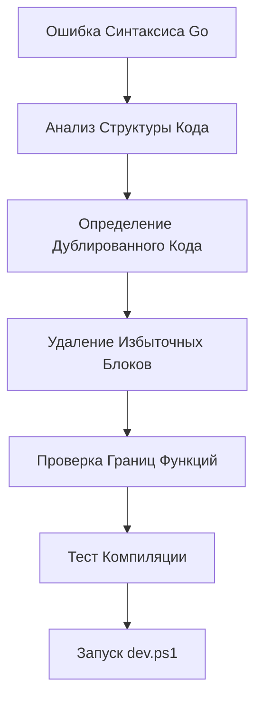

### Архитектура Тестирования Playwright MCP

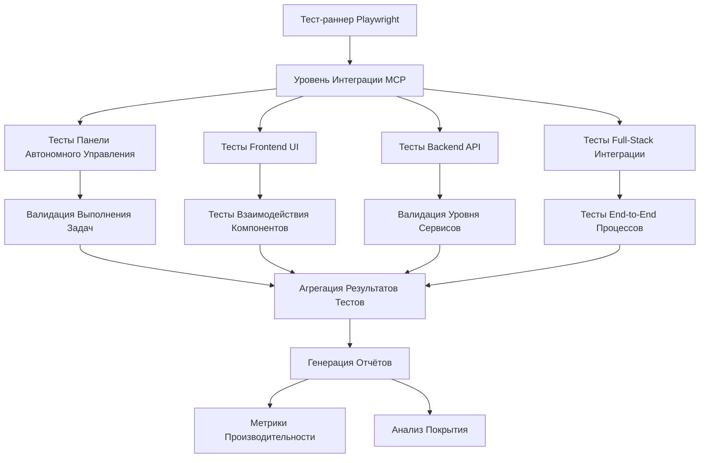

## Исправление Синтаксической Ошибки Go

### Анализ Проблемы

Ошибка возникает на строке 228 в `ai_service.go`:
```
syntax error: non-declaration statement outside function body
```

**Корневая Причина**: Дублированный блок кода существует вне границ функций, содержащий:
- Объявления переменных
- Условную логику
- Инструкции return

### Стратегия Решения

| Компонент | Действие | Обоснование |
|-----------|--------|--------|
| **Удаление Блока Кода** | Удалить строки 225-239 | Дублированная логика уже реализована в функции |
| **Проверка Границ Функций** | Обеспечить правильные закрывающие скобки | Предотвращение утечки области видимости |
| **Проверка Импортов** | Проверить импорт пакета fmt | Поддержка форматирования ошибок |

### Шаги Реализации

1. **Определить Дублированный Блок**: Строки 225-239 содержат логику, уже реализованную в функции
2. **Удалить Избыточный Код**: Удалить дублированную логику выбора провайдера/модели
3. **Проверить Структуру Функции**: Убедиться, что функция `GetIntelligentService()` правильно закрыта
4. **Протестировать Компиляцию**: Запустить `go mod tidy` и `go build` для проверки исправления

## Подробная Стратегия Тестирования через MCP

Поскольку MCP уже подключён, необходимо создать комплексную систему тестирования, которая полностью проверяет все аспекты взаимодействия с MCP инструментами.

### Архитектура MCP Тестирования

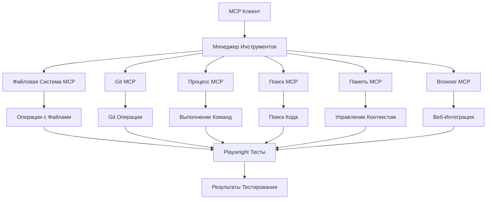

### Детальное Тестирование MCP Инструментов

#### 1. Тестирование Filesystem MCP

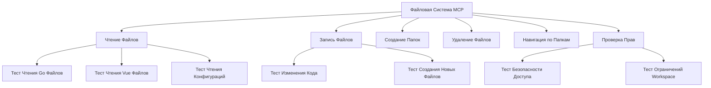

**Ключевые тестовые сценарии:**

| Сценарий | Описание | Ожидаемый Результат |
|-----------|-------------|-------------------|
| **Чтение Go файлов** | Чтение ai_service.go через MCP | Полное содержимое файла |
| **Запись конфигураций** | Изменение task_protocol.yaml | Успешное сохранение |
| **Навигация по проекту** | Обход структуры backend/ | Полный список файлов |
| **Безопасность** | Попытка доступа за пределы workspace | Отклонение доступа |

#### 2. Тестирование Git MCP

```mermaid
sequenceDiagram
    participant T as Тест
    participant G as Git MCP
    participant R as Репозиторий
    
    T->>G: git status
    G->>R: Проверка состояния
    R-->>G: Список изменений
    G-->>T: Статус репозитория
    
    T->>G: git add .
    G->>R: Добавление файлов
    R-->>G: Подтверждение
    G-->>T: Успешное добавление
    
    T->>G: git commit -m "Тестовый коммит"
    G->>R: Создание коммита
    R-->>G: Коммит создан
    G-->>T: Hash коммита
    
    T->>G: git log --oneline -5
    G->>R: Получение истории
    R-->>G: Последние коммиты
**Специальные Git тесты:**

| Команда | Цель Теста | Критерии Успеха |
|---------|-------------|----------------|
| `git status` | Проверка состояния репозитория | Корректный вывод статуса |
| `git diff` | Просмотр изменений | Отображение diff между версиями |
| `git branch` | Управление ветками | Список всех веток |
| `git log` | Просмотр истории | Полная история коммитов |

#### 3. Тестирование Process MCP

```mermaid
graph TD
    A[Процесс MCP] --> B[Выполнение Go Команд]
    A --> C[Выполнение NPM Команд]
    A --> D[Запуск Wails]
    A --> E[Тестирование Компиляции]
    
    B --> F[go mod tidy]
    B --> G[go build]
    B --> H[go test]
    
    C --> I[npm install]
    C --> J[npm run build]
    C --> K[npm run test]
    
    D --> L[wails dev]
    D --> M[wails build]
    
    E --> N[Компиляция Backend]
    E --> O[Компиляция Frontend]
```

**Критические команды для тестирования:**

```bash
# Проверка синтаксиса Go
go mod tidy
go build ./backend/...
go vet ./backend/...

# Проверка Frontend
npm run lint
npm run type-check
npm run build

# Запуск разработки
wails dev

# Тестирование
go test -v ./backend/...
npm run test:unit
npm run test:e2e
```

#### 4. Тестирование Search MCP

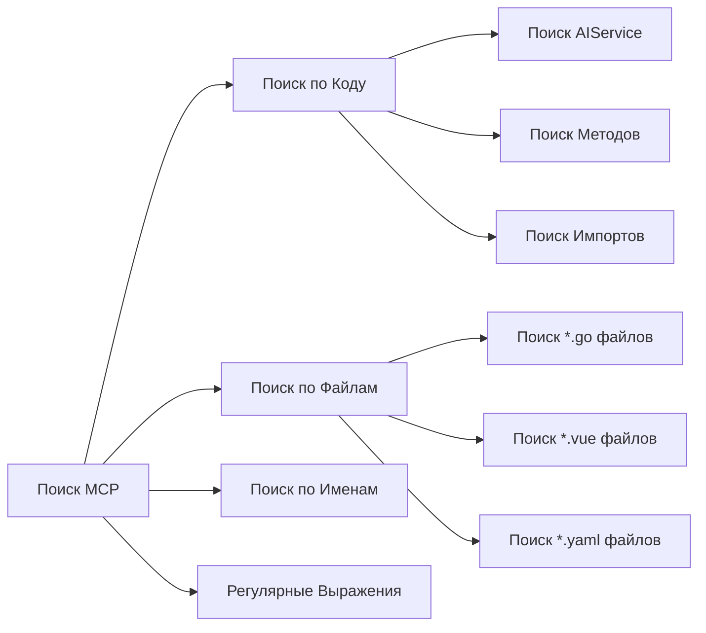

**Примеры поисковых запросов:**

| Тип Поиска | Пример Запроса | Ожидаемые Результаты |
|-------------|----------------|--------------------|
| **Классы/Структуры** | `AIService` | Файл ai_service.go |
| **Методы** | `GetIntelligentService` | Определение метода |
| **Конфигурации** | `task_protocol` | Файлы .yaml |
| **Импорты** | `import.*wails` | Все Wails импорты |

#### 5. Тестирование Memory MCP

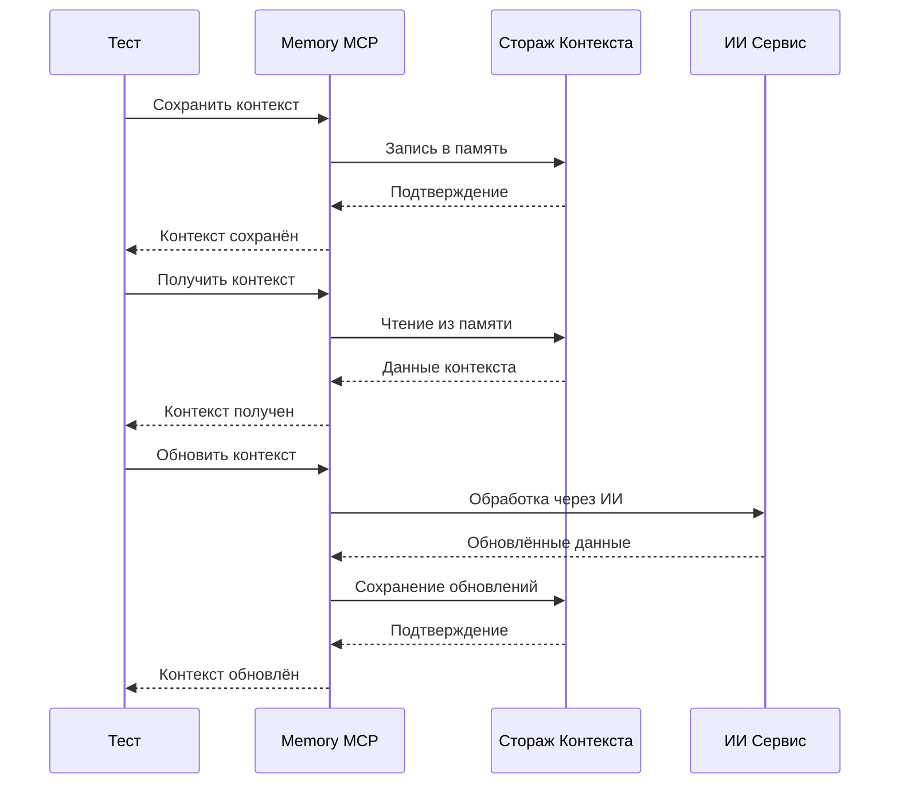

**Операции с контекстом:**

| Операция | Параметры | Проверка |
|----------|------------|----------|
| **Сохранение** | Ключ, данные, TTL | Успешное сохранение |
| **Получение** | Ключ | Корректные данные |
| **Обновление** | Ключ, новые данные | Синхронизация |
| **Удаление** | Ключ | Очистка памяти |

#### 6. Тестирование Browser MCP

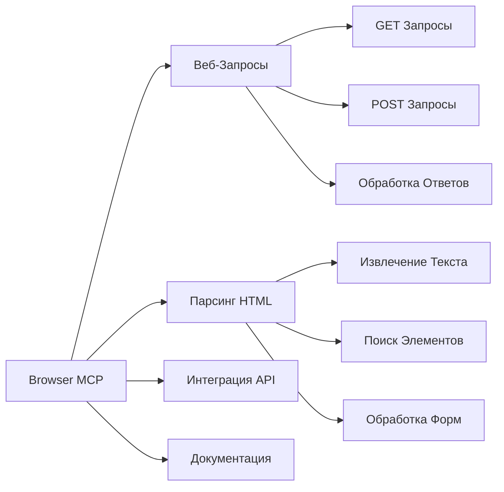

**Сценарии веб-интеграции:**

| Задача | URL | Ожидаемый Результат |
|-------|-----|--------------------|
| **Документация Go** | https://golang.org/doc | Получение справки |
| **Документация Vue** | https://vuejs.org/guide | Получение гайдов |
| **GitHub Issues** | https://github.com/user/repo/issues | Список проблем |
| **Новости технологий** | https://news.ycombinator.com | Последние обновления |

### Комплексные Сценарии MCP Тестирования

#### Интеграционные Тесты с Несколькими MCP Инструментами

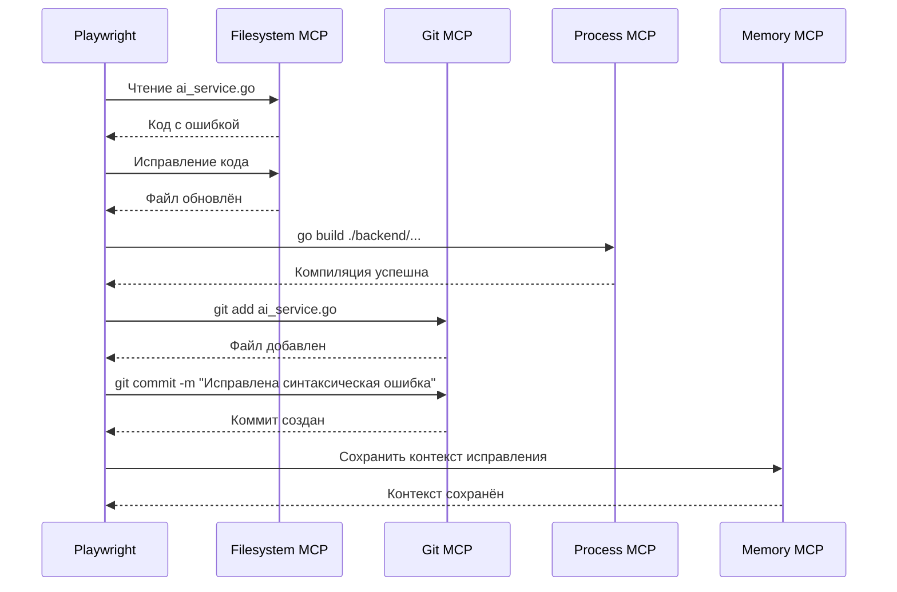

#### Автономные Тестовые Потоки

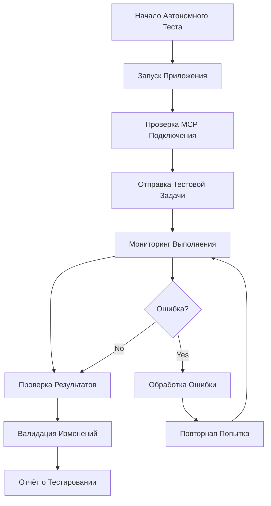

### Test Suite Architecture

#### 1. Frontend Component Testing

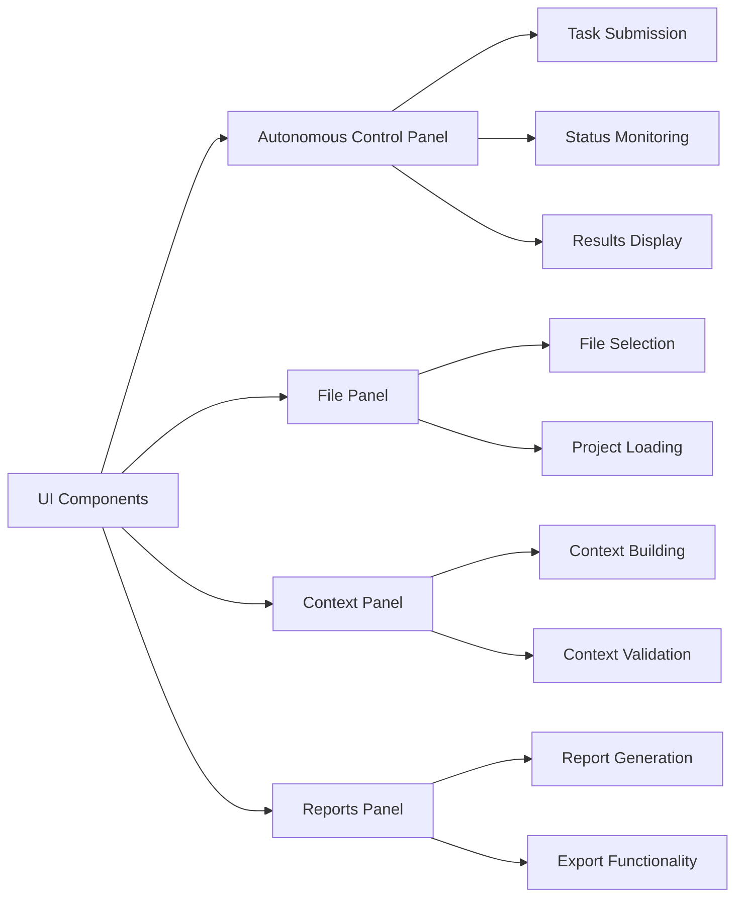

#### 2. Backend Service Testing

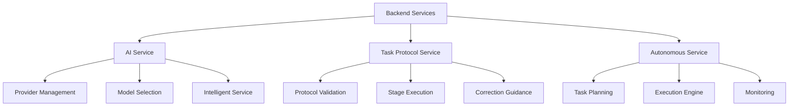

### Test Scenarios

#### Core Functionality Tests

| Test Category | Test Cases | Expected Behavior |
|--------------|------------|------------------|
| **Autonomous Mode** | Task submission, execution monitoring, result validation | Complete task lifecycle without intervention |
| **AI Integration** | Provider switching, model selection, response streaming | Proper AI service integration |
| **Context Management** | Context building, validation, token management | Efficient context handling |
| **File Operations** | Project loading, file selection, modification tracking | Reliable file system interaction |

#### MCP-Specific Tests

| MCP Tool | Test Focus | Validation Criteria |
|----------|------------|-------------------|
| **filesystem** | File operations, directory traversal | Secure file access within workspace |
| **git** | Repository operations, commit tracking | Proper version control integration |
| **process** | Command execution, output capture | Safe process management |
| **search** | Code search, symbol lookup | Accurate search results |
| **memory** | Knowledge retrieval, context caching | Efficient memory utilization |
| **browsermcp** | Web content fetching, analysis | External resource integration |

### Реализация Тестов

#### Улучшенная Конфигурация Playwright

```typescript
// Улучшенная конфигурация для MCP тестирования
export default defineConfig({
  testDir: './tests-e2e',
  timeout: 60000, // Расширено для автономных операций
  fullyParallel: false,
  retries: 3,
  workers: 1,
  
  use: {
    baseURL: 'http://localhost:34115',
    trace: 'on',
    screenshot: 'on',
    video: 'on',
    // MCP-специфичные заголовки
    extraHTTPHeaders: {
      'X-MCP-Client': 'playwright-test'
    }
  },
  
  projects: [
    {
      name: 'mcp-integration',
      testDir: './tests-e2e/mcp',
      use: { ...devices['Desktop Chrome'] }
    },
    {
      name: 'autonomous-workflow',
      testDir: './tests-e2e/autonomous',
      use: { ...devices['Desktop Chrome'] }
    }
  ]
});
```

#### Структура Тестовых Случаев

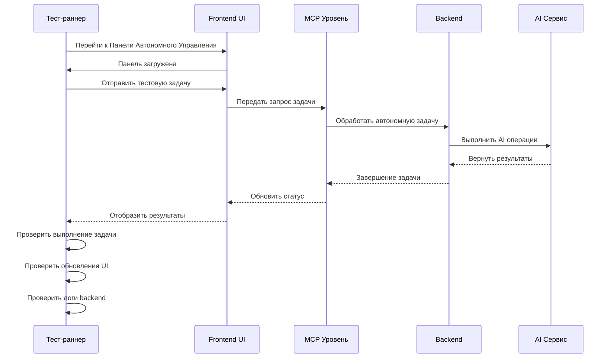

### Тестирование Производительности

#### Сбор Метрик

| Тип Метрики | Измерение | Целевой Порог |
|-------------|-------------|------------------|
| **Время Отклика** | От инициации до завершения задачи | < 30 секунд |
| **Использование Памяти** | Пиковое потребление при выполнении | < 100MB frontend |
| **Загрузка CPU** | Нагрузка обработки backend | < 80% постоянно |
| **Сетевая Задержка** | Коммуникация frontend-backend | < 100ms |

#### Сценарии Нагрузочного Тестирования

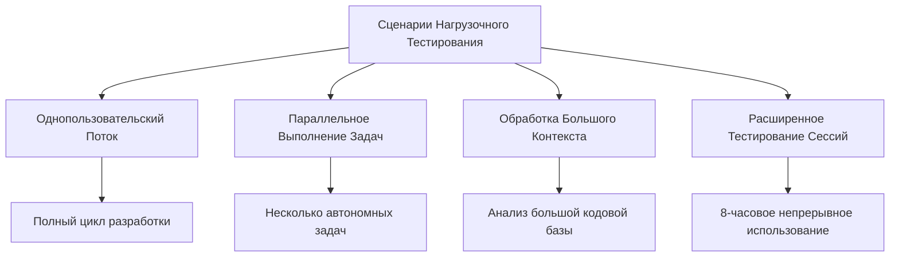

## Testing Execution Plan

### Phase 1: Syntax Error Resolution
1. **Fix Go Code**: Remove duplicate code block
2. **Verify Compilation**: Run `go mod tidy` and build
3. **Launch Application**: Execute `dev.ps1`
4. **Basic Smoke Test**: Verify application starts

### Phase 2: MCP Tool Validation
1. **Tool Availability Check**: Verify all required MCP tools
2. **Connection Testing**: Validate MCP communication
3. **Permission Verification**: Test security restrictions
4. **Command Whitelisting**: Verify allowed commands

### Phase 3: Comprehensive Testing
1. **Frontend Component Tests**: UI interaction validation
2. **Backend Service Tests**: API endpoint verification
3. **Integration Tests**: Full workflow validation
4. **Performance Tests**: Load and stress testing

### Phase 4: Autonomous Workflow Testing
1. **Task Submission**: Various task types
2. **Execution Monitoring**: Progress tracking
3. **Result Validation**: Output verification
4. **Error Handling**: Failure recovery testing

## Error Handling and Recovery

### Test Failure Scenarios

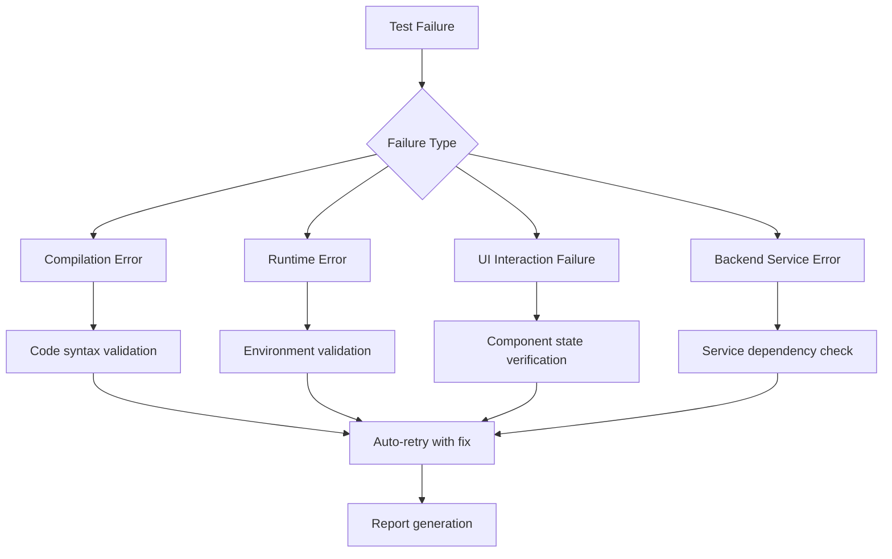

### Recovery Strategies

| Error Type | Recovery Action | Escalation Path |
|------------|----------------|-----------------|
| **Syntax Error** | Auto-fix and retry | Manual code review |
| **Timeout** | Retry with extended timeout | Performance analysis |
| **UI Element Not Found** | Wait and retry | Component architecture review |
| **API Failure** | Service restart | Backend diagnostics |

## Quality Assurance

### Test Coverage Requirements

| Component | Coverage Target | Validation Method |
|-----------|----------------|------------------|
| **Frontend Components** | 90% | Component interaction tests |
| **Backend Services** | 85% | Integration tests |
| **API Endpoints** | 95% | End-to-end tests |
| **MCP Integration** | 80% | Tool-specific tests |

### Continuous Integration

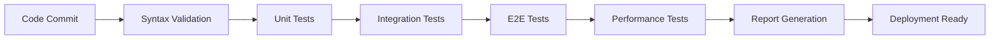

## Тестирование

### Стратегия Модульного Тестирования
- **Frontend**: Vitest с JSDOM для тестирования компонентов
- **Backend**: Фреймворк Go testing для проверки сервисов
- **Интеграция**: Playwright для межслойного тестирования

### Управление Тестовыми Данными
- **Мок-Данные**: Структурированные тестовые наборы данных
- **Настройка Окружения**: Изолированные тестовые окружения
- **Управление Состоянием**: Очистка состояния между тестами

### Отчётность и Аналитика
- **Результаты Тестов**: HTML-отчёты с детальными метриками
- **Метрики Производительности**: Автоматизированное отслеживание производительности
- **Анализ Покрытия**: Отчёты о покрытии кода
- **Анализ Сбоев**: Автоматизированная категоризация ошибок